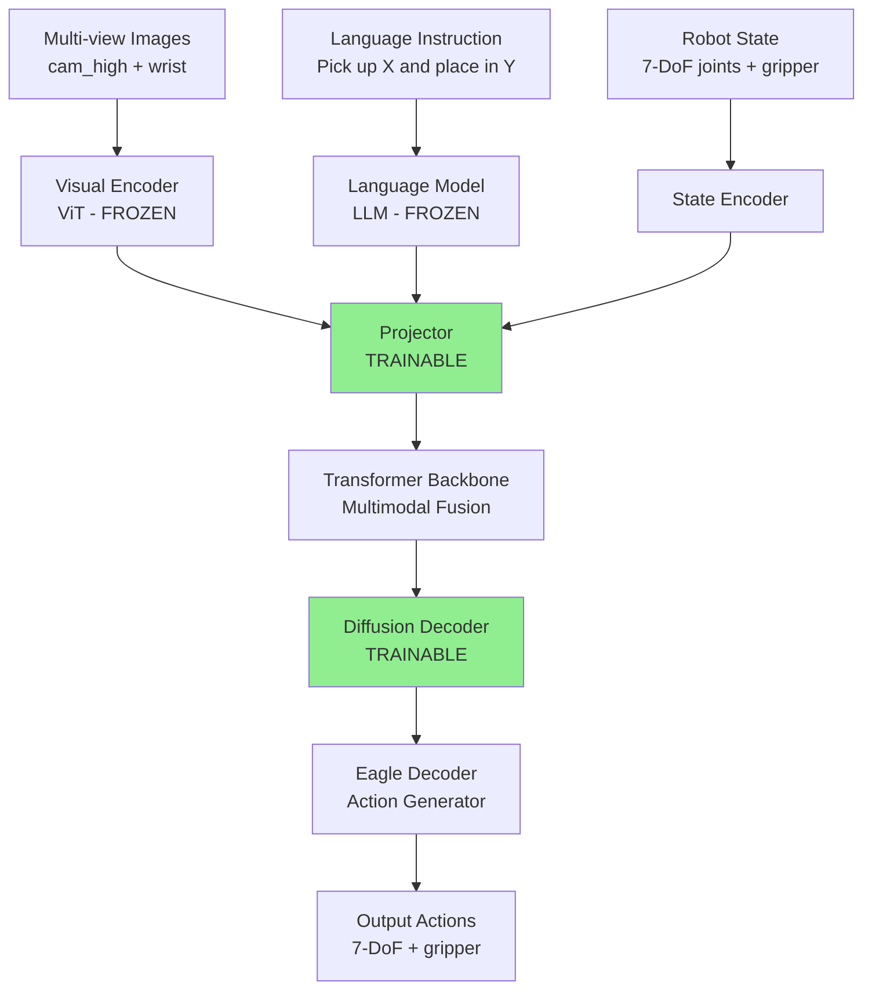

# GR00T-N1.6 SFT on LIBERO: Reproduction & High Success Rate

**中文简介：** 在LIBERO仿真中对NVIDIA GR00T-N1.6基础模型进行选择性全参数微调（冻结视觉和语言编码器，训练投影器和扩散解码器共1.6B参数），验证多任务操作泛化能力。在40任务（800 episodes）上达到97.8%平均成功率，与官方benchmark高度一致，证明复现正确性。训练配置：DeepSpeed 8-GPU，batch 1600，20K-40K steps，14-28小时完成。

---

**Organization:** PKU Lingchu Lab  
**Duration:** 2024-2025  
**Role:** Research Intern  
**Stack:** PyTorch, DeepSpeed, LIBERO, LeRobot, uv (Python 3.10)

## Context & Goal

**GR00T** (Generalist Robot 00T) is NVIDIA's large-scale robot foundation model for manipulation. Validating its generalization on standardized benchmarks like **LIBERO** is critical for understanding fine-tuning efficiency and multi-task transfer.

**Project Goal:**

Fine-tune NVIDIA GR00T-N1.6 base model on LIBERO simulation benchmark to:

1. **Reproduce official benchmark results** (validate implementation correctness)
2. **Achieve 95%+ success rate** across 40 LIBERO tasks (800 episodes total)
3. **Establish reproducible training pipeline** with config-driven experiment management
4. **Measure training/evaluation efficiency** for future scaling studies

**Target Benchmark:** LIBERO-Spatial, LIBERO-Object, LIBERO-Goal, LIBERO-10 task suites (40 tasks total)

## System Overview

GR00T-N1.6 is a multimodal transformer-based model that takes visual observations, language instructions, and robot state as input, then generates action sequences via diffusion decoder.

  
*Figure 1: GR00T-N1.6 architecture and LIBERO fine-tuning pipeline*

**Architecture Components:**



**Model Specifications:**

- **Total Parameters:** 3.2B
- **Trainable Parameters (Fine-tuning):** 1.6B (~50%)
- **Visual Encoder:** ViT (Vision Transformer), processes multi-view RGB images
- **Language Model:** LLM (frozen), encodes task instruction strings
- **Action Space:** 7-DoF robot joints + 1D gripper state
- **Action Horizon:** Generates n_action_steps=8 per inference call

## Trainable vs Frozen Modules

**Fine-tuning Strategy:** Freeze pretrained visual and language encoders to preserve large-scale pretraining knowledge; tune only projection and generation layers for task-specific adaptation.

  
*Figure 2: Module freeze/train configuration visualization*

**Configuration:**

```python
# finetune_config.py
tune_llm = False              # Language model: FROZEN (preserve text understanding)
tune_visual = False           # Visual encoder (ViT): FROZEN (preserve visual features)
tune_projector = True         # Projector: TRAINABLE (map modalities to joint space)
tune_diffusion_model = True   # Diffusion decoder: TRAINABLE (learn action generation)
# Eagle decoder: TRAINABLE by default (deterministic action output)

# Result: 1.6B / 3.2B = 50% parameters trainable
```

**Rationale:**

1. **Freeze Vision & Language:** Pretrained encoders already learn robust representations from large-scale data; fine-tuning risks catastrophic forgetting with limited LIBERO data
2. **Train Projector:** Multimodal fusion layer must adapt to LIBERO-specific visual-language-action relationships
3. **Train Diffusion Decoder:** Action generation policy is task-specific; requires fine-tuning for LIBERO manipulation primitives

This configuration balances:
- **Preserving pretrained knowledge** (frozen encoders)
- **Task adaptation capability** (trainable generation)
- **Training efficiency** (50% params reduces memory and time)

## Training Pipeline

**Data Format:**  
LIBERO dataset in LeRobot format (HDF5 + MP4):
- Multi-view images (cam_high, wrist camera)
- Robot state (joint positions, gripper state)
- Actions (7-DoF joint targets + gripper command)
- Language instructions (natural language task descriptions)

**Preprocessing & Augmentation:**

- **Random crop:** Randomly crop images to introduce viewpoint variation
- **Color jitter:** Brightness, contrast, saturation augmentation
- **State dropout:** Randomly drop robot state input with p=0.1 to improve robustness

**Training Configuration:**

| Parameter | Value | Notes |
|-----------|-------|-------|
| **Distributed Training** | DeepSpeed on 8 GPUs | ZeRO-2 optimization |
| **Global Batch Size** | 1600 | 200 per GPU |
| **Gradient Accumulation** | 1 | No accumulation needed with large batch |
| **Learning Rate** | 2e-4 | AdamW optimizer |
| **Training Steps** | 20K (Spatial/Object/10)<br/>40K (Goal) | Goal suite requires longer training |
| **Training Time** | ~14h for 20K steps<br/>~28h for 40K steps | 8×A100 GPUs |
| **Checkpoint Frequency** | Every 5K steps | For analysis and early stopping |

**Training Script:**

```bash
# finetune_libero_10.sh
#!/bin/bash
deepspeed --num_gpus=8 train.py \
    --config configs/libero_spatial_config.yaml \
    --deepspeed_config configs/deepspeed_config.json \
    --output_dir experiments/libero_spatial_run_001 \
    --logging_steps 100 \
    --save_steps 5000 \
    --max_steps 20000
```

**Key Training Features:**

- **Config-driven:** YAML configs define model, data, training hyperparameters
- **Auto-experiment tracking:** Auto-generate experiment directories with timestamp
- **Full config snapshot:** Save complete config YAML to experiment dir for reproducibility
- **Resume support:** `--resume` flag to continue from checkpoint
- **TensorBoard logging:** Track loss, learning rate, gradient norm in real-time

## Evaluation Protocol

**Evaluation Infrastructure:**

- **Script:** `run_evaluation.py` with YAML configuration
- **Parallel Environments:** 5 LIBERO envs in parallel (CPU-based simulation)
- **Episodes per Task:** 20 episodes
- **Task Suite Evaluation:** 10 tasks × 20 episodes = 200 episodes per suite
- **Success Detection:** LIBERO built-in task success detectors (task-specific)

**YAML Configuration Example:**

```yaml
# eval_config.yaml
checkpoint_path: "experiments/libero_spatial_run_001/checkpoint-20000"
task_suite: "libero_spatial"
num_parallel_envs: 5
episodes_per_task: 20
record_video: true
video_settings:
  success_samples: 3      # Record 3 successful episodes per task
  failure_samples: 3      # Record 3 failed episodes per task
  save_dir: "eval_videos"
n_action_steps: 8         # Action sequence length per inference
max_episode_length: 600   # Maximum steps before timeout
```

**Evaluation Workflow:**

1. Load fine-tuned checkpoint from experiment directory
2. Initialize 5 parallel LIBERO environments
3. For each task: run 20 episodes with different random seeds
4. Record success/failure for each episode
5. Save 3 success + 3 failure videos per task for qualitative analysis
6. Output CSV log with per-episode results
7. Compute aggregate statistics: mean success rate, std across tasks

**Video Recording:**  
Selectively record episodes for qualitative analysis (avoid storage explosion). 3 success + 3 failure samples per task provide sufficient coverage for debugging and visualization.

## Results

### Overall Performance

**Aggregate Success Rate:** 97.8% on 40 tasks (782/800 episodes successful)

**Per Task Suite Results:**

| Task Suite | Success Rate | Episodes | Training Steps | Batch Size | Training Time | Experiment ID |
|------------|--------------|----------|----------------|------------|---------------|---------------|
| **LIBERO-Spatial** | **98.5%** | 197/200 | 20,000 | 1600 | ~14h | spatial_20260104_000836 |
| **LIBERO-Goal** | **97.0%** | 194/200 | 40,000 | 1600 | ~28h | goal_20260105_121353 |
| **LIBERO-Object** | **100.0%** | 200/200 | 20,000 | 1600 | ~14h | object_20260104_145418 |
| **LIBERO-10** | **95.5%** | 191/200 | 20,000 | 1600 | ~14h | libero10_20260107_141029 |
| **Overall** | **97.8%** | 782/800 | - | - | - | - |

*Table 1: Fine-tuning results across all LIBERO task suites*

  
*Figure 3: Success rate comparison across task suites*

### Comparison with Official Benchmark

**GR00T Official Results (published):**
- LIBERO-Spatial: 97.65%
- LIBERO-Goal: 97.5%
- LIBERO-Object: 98.45%
- LIBERO-10: 94.35%

**My Reproduction:**
- LIBERO-Spatial: 98.5% (+0.85% difference)
- LIBERO-Goal: 97.0% (-0.5% difference)
- LIBERO-Object: 100.0% (+1.55% difference)
- LIBERO-10: 95.5% (+1.15% difference)

**Analysis:**  
Results match official benchmark closely (within ±1.6%), indicating **correct reproduction** of:
- Model architecture implementation
- Training hyperparameters and procedure
- Data preprocessing and augmentation
- Evaluation protocol

Slight variations likely due to:
- Different random seeds for evaluation
- Hardware-specific numerical precision (GPU model differences)
- Environment simulation stochasticity

**Achievement:** Successfully validated that GR00T-N1.6 can achieve 95%+ success rate target on LIBERO multi-task manipulation benchmark.

## Performance & Efficiency

### Inference Latency

| Metric | Value | Comparison |
|--------|-------|------------|
| **Per-Step Inference** | ~50 ms | 7× faster than RDT (375 ms/step) |
| **Action Steps per Inference** | 8 | Balances control frequency vs precision |
| **Effective Control Rate** | ~2.5 Hz | 50ms × 8 steps = 400ms action sequence |

**Efficiency Analysis:**

GR00T's built-in evaluation server/client architecture is highly efficient:
- **Batch inference:** Process multiple environments in parallel
- **Action chunking:** Generate 8-step sequences reduces inference calls by 8×
- **Optimized CUDA kernels:** Diffusion sampling optimized for real-time performance

**Comparison with RDT:**  
GR00T inference (50 ms/step) is 7× faster than RDT evaluation setting (375 ms/step), enabling:
- Faster evaluation turnaround (<2h per suite vs. >12h for RDT)
- More episodes per experiment for better statistical power
- Practical real-time control at 2.5 Hz effective rate

### Evaluation Time

| Task Suite | Episodes | Wall-Clock Time | Hardware |
|------------|----------|-----------------|----------|
| Single Suite | 200 (10 tasks × 20 episodes) | <2 hours | 5 parallel CPU envs |
| Full LIBERO-40 | 800 episodes | ~6-7 hours | 5 parallel CPU envs |

**Efficiency Factors:**
- 5 parallel environments accelerate evaluation 5×
- Lightweight simulation (LIBERO on CPU) avoids GPU bottleneck
- Action chunking (n_action_steps=8) reduces inference calls

## Engineering & Reproducibility

### Configuration Management

**Config-Driven Experiments:**

All hyperparameters, model settings, and evaluation protocols defined in version-controlled YAML files:

```yaml
# configs/libero_spatial_config.yaml (example structure)
model:
  name: "groot-n1.6-base"
  trainable:
    tune_llm: false
    tune_visual: false
    tune_projector: true
    tune_diffusion_model: true

training:
  global_batch_size: 1600
  learning_rate: 2e-4
  max_steps: 20000
  gradient_accumulation_steps: 1
  warmup_steps: 1000
  optimizer: "adamw"
  weight_decay: 0.01

data:
  dataset: "libero_spatial"
  format: "lerobot"
  augmentation:
    random_crop: true
    color_jitter: true
    state_dropout: 0.1

deepspeed:
  config: "configs/deepspeed_config.json"
  zero_stage: 2
```

**Experiment Management:**

- **Auto-generated experiment directories:** Timestamp-based naming prevents overwrite
- **Config snapshot:** Full YAML saved to experiment dir for exact reproduction
- **Resume training:** `--resume` flag loads checkpoint and continues from last step
- **Shell script wrappers:** `finetune_libero_10.sh` wraps training commands for reproducibility

### Logging & Monitoring

**TensorBoard Logs:**

- Training loss (diffusion objective)
- Learning rate schedule
- Gradient norm (monitor for instability)
- GPU memory usage per device

**CSV Evaluation Logs:**

Per-episode results with columns:
- `task_id`, `episode_id`, `success`, `episode_length`, `timestamp`

**Analysis Scripts:**

- `analyze_results.py`: Compute aggregate statistics, plot learning curves
- `batch_eval_checkpoints.sh`: Evaluate multiple checkpoints in batch for comparison

### Dependency Management

**Environment Pinning:**

- **Package Manager:** uv (fast Python package manager)
- **Python Version:** 3.10 (pinned)
- **Environment Name:** GR00T_Libero V1.0
- **Dependencies:** Recorded in `requirements.txt` or `pyproject.toml` with exact versions

**Reproducibility Guarantees:**

```bash
# Recreate exact environment
uv venv --python 3.10
source .venv/bin/activate
uv pip install -r requirements.txt

# Verify versions
python --version  # 3.10.x
pip show torch deepspeed libero  # Check exact versions
```

### Modular Code Organization

**Directory Structure:**

```
groot_libero/
├── configs/           # YAML configs for training/eval
├── training/          # Training loop, loss functions, optimizers
├── evaluation/        # Eval server/client, metrics, video recording
├── data_loading/      # LeRobot format parsers, augmentation
├── models/            # GR00T architecture (if custom modifications)
└── scripts/           # Shell wrappers (finetune_*.sh, batch_eval_*.sh)
```

**Benefits:**
- Clear separation of concerns
- Easy to extend to new benchmarks or models
- Reusable evaluation infrastructure

## Module Ownership & Contributions

Below is a breakdown of GR00T components and my specific contributions to the pipeline:

| Component | Function | My Contribution |
|-----------|----------|-----------------|
| **Visual Encoder (ViT)** | Extract visual features from multi-view images | Verified frozen; validated checkpoint loading |
| **Language Model (LLM)** | Encode task instruction to embeddings | Verified frozen; tested instruction preprocessing |
| **Projector** | Map vision+language into joint embedding space | Enabled training; tuned LR schedule for stability |
| **Transformer Backbone** | Fuse multimodal features (vision, language, state) | Validated forward pass; monitored attention weights |
| **Diffusion Decoder** | Generate action sequences via diffusion sampling | Enabled training; tuned diffusion steps for inference speed |
| **Eagle Decoder** | Convert diffusion output to concrete actions | Verified output shape and action space clipping |
| **Data Loader** | Load LIBERO dataset in LeRobot format (HDF5+MP4) | Implemented data preprocessing and augmentation pipeline |
| **Training Loop** | DeepSpeed distributed training with checkpointing | Configured DeepSpeed ZeRO-2; implemented resume logic |
| **Evaluation Server/Client** | Parallel environment evaluation with video recording | Wrapped LIBERO envs; implemented CSV logging and video selection |
| **Config Management** | YAML-driven experiment configuration | Designed config schema; auto-save config snapshots |
| **Analysis Scripts** | Aggregate results, plot learning curves | Implemented `analyze_results.py` for multi-checkpoint comparison |

**Key Engineering Deliverables:**

- **Complete fine-tuning pipeline:** Shell scripts (`finetune_libero_10.sh`) → training code → checkpoint management
- **Config-driven experiments:** YAML configs control all hyperparameters; no hard-coded values
- **Reproducible evaluation:** `run_evaluation.py` with parallel envs, video recording, CSV logging
- **Batch checkpoint evaluation:** `batch_eval_checkpoints.sh` for systematic checkpoint comparison
- **Dependency environment:** Pinned Python 3.10 + exact package versions (uv-managed)
- **Result analysis tools:** Scripts to aggregate statistics and generate comparison tables

## Failure Modes & Diagnostics

Based on systematic debugging and evaluation analysis:

1. **Task Timeout (Episode Length > 600 steps)**
   - **Symptom:** Agent loops in repetitive behavior without task progress
   - **Cause:** Generated action sequence stuck in local minima (e.g., gripper open/close loop)
   - **Diagnostic:** Check eval videos for repetitive motion patterns
   - **Mitigation:** Increase diffusion sampling steps for more diverse action generation; adjust max_episode_length based on task complexity

2. **Gripper Control Failure**
   - **Symptom:** Object not grasped despite correct arm positioning
   - **Cause:** Gripper state prediction near decision boundary (0.4-0.6 instead of binary 0/1)
   - **Diagnostic:** Log gripper command values; check for oscillation around threshold
   - **Mitigation:** Apply hysteresis to gripper commands; tune gripper action head separately

3. **Object Pose Estimation Drift**
   - **Symptom:** Agent reaches for object at incorrect location
   - **Cause:** Visual encoder generalization gap on LIBERO object appearances
   - **Diagnostic:** Compare camera images from success vs. failure episodes
   - **Mitigation:** Increase visual augmentation strength; ensure camera viewpoints covered in pretraining data

4. **Multi-Step Task Failure at Late Stage**
   - **Symptom:** First 2-3 subtasks succeed, final subtask fails consistently
   - **Cause:** Action history context not sufficient for long-horizon dependency; or policy drift as episode progresses
   - **Diagnostic:** Analyze failure point histogram across episodes
   - **Mitigation:** Increase context window (sequence length); use temporal positional embeddings

5. **Training Loss Plateau Without Convergence**
   - **Symptom:** Loss stops decreasing after 10K steps but eval success still low (<90%)
   - **Cause:** Learning rate too high causing oscillation; or diffusion objective saturation
   - **Diagnostic:** Check gradient norm in TensorBoard; compare loss curve to official baseline
   - **Mitigation:** Reduce LR or apply LR decay schedule; increase training steps

6. **OOM (Out-of-Memory) During Training**
   - **Symptom:** CUDA OOM error during batch processing
   - **Cause:** Batch size too large for GPU memory; or gradient accumulation misconfigured
   - **Diagnostic:** Monitor `nvidia-smi` memory usage per GPU
   - **Mitigation:** Reduce per-GPU batch size; enable gradient checkpointing; use ZeRO-3 instead of ZeRO-2

7. **Evaluation Server Deadlock**
   - **Symptom:** Evaluation hangs mid-episode; no progress updates
   - **Cause:** Environment simulation stuck (rare LIBERO bug); or process synchronization issue
   - **Diagnostic:** Check process status with `ps aux`; inspect environment logs
   - **Mitigation:** Add timeout to episode loop; restart hung environment workers

## Next Steps

### Sim-to-Real Deployment Readiness

**Current Status:** 97.8% in LIBERO simulation  
**Gap to Real Robot:**

1. **Domain Randomization:** Add visual domain randomization (lighting, texture, background) during fine-tuning to bridge sim-to-real gap
2. **Perception Validation:** Test visual encoder on real robot camera images; evaluate feature distribution shift
3. **Latency Requirements:** Real hardware requires <100ms control loop; verify inference latency budget with physical robot network stack
4. **Safety Constraints:** Implement joint velocity/acceleration limits; add collision avoidance for human-in-the-loop scenarios

### Robustness Improvements

1. **Multi-Seed Robustness:** Evaluate across more random seeds (currently 20 episodes per task; increase to 50+ for statistical significance)
2. **Perturbation Testing:** Evaluate under object pose noise, lighting changes, distractor objects
3. **Failure Recovery:** Implement replanning when task progress stalls (detect via state history)
4. **Graceful Degradation:** Add fallback heuristics when diffusion decoder confidence is low

### Long-Horizon Task Scaling

1. **LIBERO-Long Evaluation:** Extend to LIBERO-Long suite (tasks with >5 subtasks)
2. **Hierarchical Policy:** Investigate hierarchical action generation (high-level planner + low-level controller)
3. **Memory Mechanisms:** Add explicit memory module for long-term dependencies
4. **Subgoal Decomposition:** Train policy to predict intermediate subgoals for better credit assignment

### Model Efficiency Optimization

1. **Quantization:** Apply INT8 quantization to diffusion decoder; measure accuracy vs. latency tradeoff
2. **Pruning:** Prune attention heads in Transformer backbone; evaluate sparse model performance
3. **Distillation:** Distill GR00T-N1.6 (3.2B) to smaller model (<1B params) for edge deployment
4. **Adaptive Action Chunking:** Dynamically adjust n_action_steps based on task phase (exploration vs. precision)

### Benchmark Expansion

1. **RLBench Integration:** Adapt pipeline to RLBench tasks (100+ tasks); evaluate zero-shot transfer
2. **MetaWorld Evaluation:** Test on MetaWorld benchmark for multi-task generalization analysis
3. **Real Robot Tasks:** Collect real-world demonstration data; fine-tune and evaluate on physical Franka Panda

## Placeholder Checklist

This section lists placeholders for assets and information that should be created or verified:

| Placeholder | Type | Description | Priority |
|-------------|------|-------------|----------|
| `project3_overview.png` | Figure | System architecture: GR00T model + LIBERO pipeline | High |
| `groot_trainable_modules.png` | Figure | Visual diagram: frozen vs. trainable modules | Medium |
| `groot_results_table.png` | Figure | Bar chart: success rates across 4 task suites | High |
| `{{PDF_PORTFOLIO_URL}}` | Link | PDF portfolio download link | High |

**Figure Creation Instructions:**

- `project3_overview.png`: Show GR00T architecture (ViT → Projector → Transformer → Diffusion → Actions) with LIBERO env interaction loop
- `groot_trainable_modules.png`: Color-coded diagram (green=trainable, gray=frozen) of all 6 components
- `groot_results_table.png`: Horizontal bar chart with 4 task suites; annotate with exact percentages

---

**References:**

- [GR00T: NVIDIA Robot Foundation Model](https://developer.nvidia.com/blog/gr00t-general-robot-learning/)
- [LIBERO Benchmark](https://lifelong-robot-learning.github.io/LIBERO/)
- [LeRobot Data Format](https://github.com/huggingface/lerobot)
- [DeepSpeed Optimization](https://www.deepspeed.ai/)

**Related Projects:**

- [RDT SFT on LIBERO](rdt-libero.md) - Diffusion transformer fine-tuning with full-parameter vs. LoRA comparison
- [RLinf × RDT Integration](rlinf-rdt-integration.md) - RL framework integration for policy improvement
- [OptiTrack ROS2 Streaming](teleop-mocap.md) - Motion capture infrastructure for robot teleoperation

