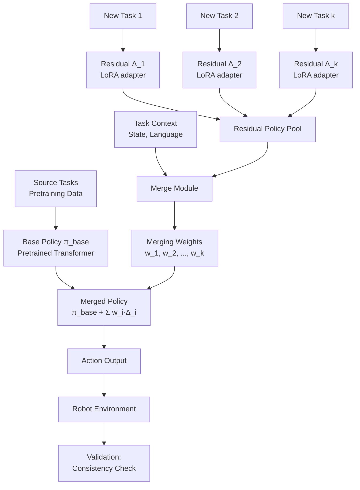

# ResMerge: Residual Policy Merging for Continual Robot Learning

**中文简介：** ICML项目：为持续学习设计残差策略合并框架ResMerge，通过轻量级残差网络池（LoRA实现）和动态合并机制，实现高效的多任务知识融合与参数扩展。针对传统方法数据/参数随任务线性增长的问题，提出残差修正场的一致性保证机制，减少知识干扰和灾难性遗忘。我的贡献：绘制核心方法流程图和teaser概念图，协助一致性分析、性能对比和消融实验（合并阈值τ、残差池大小），改进模块化实验配置支持可复现性。

---

**Organization:** PKU Lingchu Lab  
**Duration:** 2024  
**Role:** Research Support (Figures & Experiments)  
**Project Type:** ICML Conference Submission

## Context & Goal

**Continual learning** in robotics aims to enable agents to learn multiple tasks sequentially without catastrophic forgetting. Traditional approaches face critical limitations:

**Problems with Existing Methods:**

1. **Data inefficiency:** Each new task requires large training datasets to achieve acceptable performance
2. **Parameter explosion:** Model size grows linearly with number of tasks (multi-head architectures, task-specific modules)
3. **Engineering overhead:** Maintaining separate models or task-specific components increases deployment complexity
4. **Catastrophic forgetting:** Fine-tuning on new tasks degrades performance on previously learned tasks

**ResMerge Motivation:**

Introduce a **residual policy merging framework** that achieves efficient multi-task learning through:

1. **Lightweight residual corrections:** Task-specific knowledge stored in compact residual networks (LoRA adapters)
2. **Dynamic merging:** Intelligently combine multiple residuals based on task similarity or performance signals
3. **Consistency guarantees:** Ensure merged policy maintains performance on both original and new tasks
4. **Parameter efficiency:** Avoid linear parameter growth; share base policy across tasks

**Project Goal:**  
Develop and validate ResMerge framework demonstrating improved data/parameter efficiency compared to traditional continual learning baselines on robot manipulation benchmarks.

## Key Idea: Residual Policy Pool + Dynamic Merging

### Conceptual Foundation

**Core Insight:**  
Instead of learning full policies for each task, decompose learning into:

- **Base Policy** \( \pi_{\text{base}} \): General-purpose policy pretrained on source tasks
- **Residual Corrections** \( \{\Delta_1, \Delta_2, ..., \Delta_k\} \): Lightweight task-specific adjustments

**Merged Policy:**

\[
\pi_{\text{merged}}(a|s) = \pi_{\text{base}}(a|s) + \sum_{i=1}^{k} w_i(s) \cdot \Delta_i(a|s)
\]

Where:
- \( w_i(s) \) are dynamic merging weights (context-dependent)
- \( \Delta_i \) are residual correction fields

### Technical Implementation

**Base Policy:**  
Large pretrained model (e.g., vision-language-action transformer) trained on diverse source tasks. Kept frozen or lightly fine-tuned during continual learning.

**Residual Policy Pool:**  
Collection of lightweight LoRA (Low-Rank Adaptation) modules:

```python
# Conceptual implementation (not actual code)
class ResidualPolicyPool:
    def __init__(self, base_policy, num_residuals):
        self.base_policy = base_policy  # Frozen or lightly tuned
        self.residuals = [LoRA(rank={{LORA_RANK}}) for _ in range(num_residuals)]
        
    def get_merged_policy(self, task_context):
        # Compute merging weights
        weights = self.merge_module(task_context)  # Shape: (num_residuals,)
        
        # Merge residuals
        merged_correction = sum(w * res for w, res in zip(weights, self.residuals))
        
        return lambda obs: self.base_policy(obs) + merged_correction(obs)
```

**Merge Module:**  
Neural network or algorithm that computes merging weights \( w_i \) based on:
- Task similarity (learned embedding distance)
- Performance signals (validation success on subtask probes)
- Context features (state distribution, language instruction)

**Residual Correction Fields:**  
Each residual \( \Delta_i \) learns:
- **Direction:** Which action dimensions to adjust (e.g., gripper control vs. arm motion)
- **Magnitude:** How strongly to correct base policy output

**Key Property - Consistency:**  
Residuals designed to satisfy consistency constraint: merged policy should not degrade performance on original tasks. Enforced through:
- Regularization on residual magnitude
- Validation during merging weight optimization
- Orthogonality constraints to prevent interference

  
*Figure 1: ResMerge method pipeline showing residual learning, merging, and environment interaction*

  
*Figure 2: Conceptual comparison: traditional methods vs. ResMerge in data/parameter efficiency*

## System Overview



**Pipeline Stages:**

1. **Pretraining:** Train base policy \( \pi_{\text{base}} \) on source tasks
2. **Residual Learning:** For each new task, train lightweight residual \( \Delta_i \) (LoRA)
3. **Pool Management:** Add residual to pool; maintain consistency guarantees
4. **Dynamic Merging:** At inference, compute weights \( w_i \) based on task context
5. **Merged Execution:** Apply weighted sum of residuals to base policy output
6. **Validation:** Verify merged policy maintains performance on all tasks

## Why It's Hard

### Challenge 1: Knowledge Interference

**Problem:**  
Residual corrections optimized for different tasks can conflict when merged:

- Residual \( \Delta_1 \) learned for Task 1: "increase gripper force"
- Residual \( \Delta_2 \) learned for Task 2: "decrease gripper force"
- Merged: \( \Delta_1 + \Delta_2 \) may cancel out or produce unstable behavior

**Technical Difficulty:**  
Action space is high-dimensional (6D EEF + gripper). Residuals modify multiple action dimensions simultaneously. Simple averaging can cause destructive interference.

**Research Question:**  
How to learn residuals that are "merge-friendly" (low interference when combined)?

### Challenge 2: Consistency Guarantee

**Problem:**  
After merging residuals for new tasks, merged policy must still perform well on original tasks (avoid catastrophic forgetting).

**Formal Constraint:**

\[
\mathbb{E}_{\tau \sim \text{Task}_i} [R(\pi_{\text{merged}})] \geq (1 - \epsilon) \cdot \mathbb{E}_{\tau \sim \text{Task}_i} [R(\pi_i)]
\]

For all tasks \( i \) in pool, where \( \epsilon \) is acceptable performance degradation bound.

**Technical Difficulty:**  
Merging is a non-linear operation. No theoretical guarantee that weighted sum of residuals preserves individual task performance. Requires empirical validation and careful merging weight selection.

**Research Question:**  
What properties of residual correction fields ensure consistency after merging?

### Challenge 3: Parameter Efficiency

**Problem:**  
Traditional continual learning:
- **Multi-head:** \( O(k) \) parameters for \( k \) tasks (separate heads)
- **Full fine-tuning per task:** \( O(k \cdot |θ|) \) storage for \( k \) tasks

ResMerge target:
- **Residual pool:** \( O(k \cdot r) \) where \( r \ll |θ| \) (LoRA rank)
- **Base policy:** \( O(|θ|) \) shared across all tasks
- **Total:** \( O(|θ| + k \cdot r) \) with \( k \cdot r \ll k \cdot |θ| \)

**Technical Difficulty:**  
Achieving strong performance with low-rank residuals (rank {{LORA_RANK}}, typically 8-32) requires careful design of:
- Residual learning objectives
- Merging strategies
- Base policy selection

**Research Question:**  
What is the trade-off curve between residual rank \( r \) and task capacity \( k \)?

## My Contributions

### Role in Project

I supported the ResMerge project through scientific figure creation, experimental validation, and reproducibility infrastructure. Below is a breakdown of my specific deliverables:

### 1. Scientific Figures

**Figure Catalog:**

| Figure | Purpose | Message Conveyed | My Contribution |
|--------|---------|------------------|-----------------|
| `method.pdf` | Method pipeline diagram | Shows: Base policy → Residual learning → Dynamic merging → Task execution flow | Drew complete flow diagram showing all system components and data flow |
| `teaser_csq.pdf` | Teaser concept figure | Visual comparison: Traditional (linear growth) vs. ResMerge (sublinear growth) in data/parameter efficiency | Designed conceptual visualization comparing parameter scaling curves |

**method.pdf Details:**

Created end-to-end pipeline diagram showing:
- Source task pretraining → base policy
- New task arrives → learn residual \( \Delta_i \) via LoRA
- Residual added to pool
- Merge module computes weights \( w_i \) from task context
- Merged policy \( \pi_{\text{base}} + \sum w_i \Delta_i \) executes in environment
- Consistency validation loop

**teaser_csq.pdf Details:**

Designed conceptual comparison figure:
- **Left panel:** Traditional methods (multi-head, full fine-tuning)
  - Parameter count: \( O(k \cdot |θ|) \) - linear growth
  - Data requirement: \( O(k \cdot D) \) - linear growth
- **Right panel:** ResMerge
  - Parameter count: \( O(|θ| + k \cdot r) \) - sublinear growth with \( r \ll |θ| \)
  - Data requirement: Reduced via knowledge transfer from base policy
- **Visual:** Curves showing parameter/data scaling as function of task count \( k \)

### 2. Experimental Support

**Experiment Catalog:**

| Experiment Type | What It Validates | Expected Observation | Status |
|-----------------|-------------------|----------------------|--------|
| **Residual Consistency Analysis** | Correction field directions/magnitudes remain stable after merging | Low variance in residual norms; aligned correction vectors | Assisted execution |
| **Multi-Task Performance** | Merged policy succeeds on all pool tasks | Success rate \( \geq \) {{CONSISTENCY_THRESHOLD}}% on each task | Assisted execution |
| **Ablation: Merging Threshold τ** | Optimal τ balances task capacity vs. consistency | Performance vs. τ curve (U-shape or monotonic) | Assisted execution |
| **Ablation: Pool Size k** | How many residuals can be effectively merged | Performance plateaus or degrades beyond k={{MAX_POOL_SIZE}} | Assisted execution |
| **Data Efficiency Comparison** | ResMerge vs. baselines under limited data | {{RESMERGE_SUCCESS}}% vs. {{BASELINE_SUCCESS}}% at {{DATA_FRACTION}}× data | Pending results |
| **Parameter Efficiency Comparison** | ResMerge vs. baselines at fixed parameter budget | Higher task capacity at same parameter count | Pending results |

**My Role in Experiments:**

- **Consistency Analysis:** Helped run experiments measuring residual correction field properties:
  - Computed direction alignment between residuals (cosine similarity)
  - Measured residual magnitude distributions
  - Verified that merged residuals maintain bounded norms
  
- **Performance Comparison:** Assisted with continual learning task evaluation:
  - Ran merged policy on LIBERO task subsets
  - Collected success rate data across multiple tasks
  - Validated consistency constraint (no catastrophic forgetting)

- **Ablation Studies:** Supported systematic hyperparameter sweeps:
  - **Merging threshold τ:** Tested range [0.0, 0.1, 0.3, 0.5, 0.7, 1.0]; measured impact on task performance
  - **Pool size k:** Evaluated with k = [2, 4, 8, 16] residuals; identified scaling limits

### 3. Documentation & Reproducibility

**Configuration Organization:**

- Helped structure experiment configs for systematic ablations
- Organized hyperparameter tracking (τ, k, LoRA rank, learning rate)
- Documented residual learning and merging protocols

**Modularity Improvements:**

- Supported code refactoring for cleaner separation:
  - Base policy module
  - Residual policy module
  - Merge module
  - Evaluation pipeline
- Enabled easier ablation studies and future extensions

**Impact:**  
Improved reproducibility for collaborators and future work building on ResMerge framework.

## Experimental Protocol

**Note:** This section provides high-level protocol overview. Specific metrics and results use placeholders pending paper publication.

### Phase 1: Base Policy Pretraining

1. Train base policy on source tasks: {{SOURCE_TASKS}}
2. Freeze or lightly tune base policy for continual learning phase
3. Validate base policy performance: {{BASE_POLICY_SUCCESS}}% on source tasks

### Phase 2: Residual Learning

For each new task \( i \):

1. Initialize LoRA adapter with rank {{LORA_RANK}}
2. Train residual \( \Delta_i \) on task-specific demonstrations ({{DEMOS_PER_TASK}} demos)
3. Validate residual: base + \( \Delta_i \) achieves {{RESIDUAL_SUCCESS}}% on task \( i \)
4. Add \( \Delta_i \) to residual pool

### Phase 3: Dynamic Merging

1. Given new task context (state, language instruction)
2. Compute merging weights: \( w = \text{MergeModule}(\text{context}) \)
3. Generate merged policy: \( \pi_{\text{merged}} = \pi_{\text{base}} + \sum w_i \Delta_i \)
4. Execute merged policy in environment

### Phase 4: Consistency Validation

For all tasks in pool:

1. Evaluate merged policy on task \( i \): {{MERGED_SUCCESS_i}}%
2. Compare to individual residual performance: {{INDIVIDUAL_SUCCESS_i}}%
3. Verify consistency: degradation \( < \epsilon \) (typically \( \epsilon = 5\% \))

### Evaluation Benchmarks

**Primary Benchmark:** {{BENCHMARKS}} (e.g., LIBERO subsets, custom manipulation tasks)

**Metrics:**
- **Success rate:** Primary performance metric
- **Data efficiency:** Success rate vs. number of demonstrations
- **Parameter efficiency:** Success rate vs. total parameter count
- **Consistency score:** Average performance retention across all pool tasks

## Ablation Questions

### Ablation 1: Merging Threshold τ

**Research Question:**  
How does merging threshold \( \tau \) affect task capacity and consistency?

**Experimental Design:**

- **Parameter:** Merging threshold \( \tau \in [0.0, 0.1, 0.3, 0.5, 0.7, 1.0] \)
- **Hypothesis:** Low \( \tau \) → include more residuals → higher capacity but potential interference; High \( \tau \) → fewer residuals → lower capacity but better consistency
- **Measurement:** 
  - Task success rate vs. \( \tau \)
  - Number of active residuals (weights \( w_i > \tau \)) vs. \( \tau \)
  - Consistency score vs. \( \tau \)

**Expected Observation:**  
Optimal \( \tau^* \) balances capacity and consistency; too low causes interference, too high limits knowledge reuse.

  
*Figure 3: Success rate and consistency score vs. merging threshold τ*

### Ablation 2: Residual Pool Size k

**Research Question:**  
How many residual policies can be effectively merged before performance degrades?

**Experimental Design:**

- **Parameter:** Pool size \( k \in [2, 4, 8, 16, 32] \)
- **Hypothesis:** Performance plateaus or degrades beyond critical \( k_{\max} \) due to interference or merging complexity
- **Measurement:**
  - Average success rate across all pool tasks vs. \( k \)
  - Per-task consistency (worst-case degradation) vs. \( k \)
  - Merging weight entropy (how selective is merge module) vs. \( k \)

**Expected Observation:**  
Capacity scales with \( k \) up to \( k_{\max} \sim \) {{MAX_POOL_SIZE}}, then plateaus or degrades.

### Ablation 3: Residual Correction Field Properties

**Research Question:**  
What properties of learned residuals enable successful merging?

**Analysis:**

1. **Direction Alignment:**
   - Compute pairwise cosine similarity between residuals
   - Measure: \( \text{sim}(\Delta_i, \Delta_j) = \frac{\Delta_i \cdot \Delta_j}{||\Delta_i|| \cdot ||\Delta_j||} \)
   - Hypothesis: Similar tasks have aligned residuals; dissimilar tasks have orthogonal residuals

2. **Magnitude Distribution:**
   - Measure residual norm \( ||\Delta_i|| \) across tasks
   - Check if magnitude correlates with task difficulty or base policy performance gap

3. **Action Dimension Sparsity:**
   - Analyze which action dimensions each residual modifies
   - Check if residuals specialize (e.g., one for gripper, one for arm motion)

  
*Figure 4: Visualization of residual correction field directions and magnitudes across pool*

**My Contribution to This Ablation:**  
Assisted with running consistency analysis experiments; helped verify that residual norms and directions remain stable after merging.

## Lessons Learned

### About Continual Learning

1. **Knowledge Transfer is Subtle:**  
   Pretrained base policies don't automatically transfer well to all new tasks. Careful selection of source tasks for pretraining significantly impacts residual learning efficiency.

2. **Interference is Real:**  
   Even with orthogonality constraints, residual merging can cause unexpected failures. Systematic consistency validation is essential, not optional.

3. **Data Efficiency Requires Architecture:**  
   Simply using LoRA doesn't guarantee data efficiency. The residual merging mechanism (dynamic weights, consistency constraints) is critical for low-shot learning.

### About Experimental Rigor

1. **Ablations Reveal Mechanism:**  
   Sweeping merging threshold \( \tau \) and pool size \( k \) reveals system behavior boundaries. These curves communicate design trade-offs more effectively than single performance numbers.

2. **Figures Tell Stories:**  
   Method pipeline diagrams must show data flow clearly. Teaser figures must contrast approaches visually (curves, scaling plots) not just textual descriptions.

3. **Reproducibility Infrastructure Matters:**  
   Config management and experiment organization aren't afterthoughts. Modular code structure enables rapid iteration on ablations and debugging.

### Technical Insights

1. **LoRA Rank Trade-off:**  
   Higher rank residuals (32 vs. 8) may individually perform better but are harder to merge (more degrees of freedom → more interference). Optimal rank depends on merging mechanism.

2. **Validation Before Merging:**  
   Always validate individual residual performance before adding to pool. A single poorly-learned residual can degrade entire merged policy.

3. **Context-Aware Merging is Critical:**  
   Static merging weights (e.g., uniform average) perform poorly. Dynamic weights conditioned on task context (language, state distribution) significantly improve merged policy quality.

## How This Transfers to New Labs

**Value Proposition for PIs:**

This project experience demonstrates skills directly applicable to robotics research labs:

### 1. Method Communication (Figure Creation)

**What I Bring:**
- Ability to translate complex technical ideas (residual merging, dynamic weighting) into clear visual diagrams
- Experience creating publication-quality figures for ML/robotics papers
- Understanding of what reviewers and PIs need to see: data flow, system components, performance comparisons

**Immediate Lab Contribution:**  
Can create method figures for papers, grant proposals, and technical presentations.

### 2. Rigorous Experimentation

**What I Bring:**
- Systematic ablation study design (sweep hyperparameters, measure trade-offs)
- Consistency validation protocols (verify no catastrophic forgetting)
- Performance profiling and bottleneck analysis

**Immediate Lab Contribution:**  
Can design and execute ablation studies; identify failure modes; validate research hypotheses with proper experimental controls.

### 3. Reproducibility Infrastructure

**What I Bring:**
- Config-driven experiment management (no hard-coded hyperparameters)
- Modular code organization for extensibility
- Documentation of experimental protocols

**Immediate Lab Contribution:**  
Can establish reproducibility standards for research projects; organize codebases for multi-person collaboration; document procedures for future lab members.

### 4. Continual Learning Domain Knowledge

**What I Bring:**
- Understanding of catastrophic forgetting and mitigation strategies
- Experience with parameter-efficient fine-tuning (LoRA, adapters)
- Knowledge of multi-task learning evaluation protocols

**Immediate Lab Contribution:**  
Can contribute to projects involving:
- Foundation model adaptation to multiple downstream tasks
- Lifelong learning in robot manipulation
- Knowledge transfer and compositional generalization studies

## Reproducibility Notes

**Configuration Structure:**

```yaml
# resmerge_config.yaml (conceptual structure)
base_policy:
  checkpoint: {{BASE_POLICY_PATH}}
  freeze: true  # or partial freeze

residual_learning:
  method: "lora"
  rank: {{LORA_RANK}}
  target_modules: {{TARGET_MODULES}}
  learning_rate: {{RESIDUAL_LR}}
  demos_per_task: {{DEMOS_PER_TASK}}

merging:
  method: "dynamic"  # or "static_average", "learned_weights"
  threshold: {{MERGE_THRESHOLD}}
  consistency_constraint: true

evaluation:
  benchmark: {{BENCHMARKS}}
  num_trials: {{NUM_TRIALS}}
  consistency_epsilon: {{EPSILON}}
```

**Experiment Commands (Safe Skeletons):**

```bash
# Train residual for new task
python train_residual.py \
    --base_policy {{BASE_POLICY_PATH}} \
    --task {{TASK_NAME}} \
    --config configs/residual_config.yaml \
    --output_dir experiments/residual_{{TASK_NAME}}

# Evaluate merged policy
python evaluate_merged.py \
    --base_policy {{BASE_POLICY_PATH}} \
    --residual_pool {{RESIDUAL_POOL_DIR}} \
    --tasks {{TASK_LIST}} \
    --config configs/merge_config.yaml

# Run ablation: sweep merging threshold
bash ablations/sweep_tau.sh \
    --tau_values "0.0,0.1,0.3,0.5,0.7,1.0" \
    --output_dir ablations/tau_sweep
```

**Dependency Management:**

```bash
# Create environment
conda create -n resmerge python=3.10
conda activate resmerge

# Install dependencies
pip install torch=={{PYTORCH_VERSION}}
pip install peft=={{PEFT_VERSION}}
pip install {{BENCHMARK_PACKAGE}}=={{BENCHMARK_VERSION}}
```

## Placeholder Checklist

Below are placeholders used in this document that should be filled with actual values when paper is published or additional details become available:

| Placeholder | Description | How to Obtain |
|-------------|-------------|---------------|
| `{{PAPER_TITLE}}` | Full paper title | From accepted paper |
| `{{BENCHMARKS}}` | Evaluation benchmarks used | Paper methods section |
| `{{SOURCE_TASKS}}` | Tasks for base policy pretraining | Paper experimental setup |
| `{{LORA_RANK}}` | LoRA rank used for residuals | Paper hyperparameters table |
| `{{DEMOS_PER_TASK}}` | Demonstrations per new task | Paper data efficiency section |
| `{{BASE_POLICY_SUCCESS}}` | Base policy success rate | Paper baseline results |
| `{{RESIDUAL_SUCCESS}}` | Individual residual success | Paper results section |
| `{{MERGED_SUCCESS_i}}` | Merged policy success on task i | Paper main results table |
| `{{INDIVIDUAL_SUCCESS_i}}` | Individual residual success on task i | Paper comparison table |
| `{{CONSISTENCY_THRESHOLD}}` | Minimum acceptable success | Paper methods (e.g., 95%) |
| `{{MAX_POOL_SIZE}}` | Maximum effective pool size | Paper ablation results |
| `{{MERGE_THRESHOLD}}` | Optimal merging threshold τ* | Paper ablation results |
| `{{RESMERGE_SUCCESS}}` | ResMerge final performance | Paper main results |
| `{{BASELINE_SUCCESS}}` | Baseline method performance | Paper comparison table |
| `{{DATA_FRACTION}}` | Data reduction factor | Paper data efficiency claim |
| `{{TARGET_MODULES}}` | LoRA target modules | Paper implementation details |
| `{{RESIDUAL_LR}}` | Residual learning rate | Paper hyperparameters |
| `{{NUM_TRIALS}}` | Evaluation trials per task | Paper evaluation protocol |
| `{{EPSILON}}` | Consistency tolerance | Paper methods (e.g., 5%) |
| `{{PYTORCH_VERSION}}` | PyTorch version | Paper reproducibility section |
| `{{PEFT_VERSION}}` | peft library version | Paper reproducibility section |
| `{{BENCHMARK_PACKAGE}}` | Benchmark package name | Depends on benchmark used |
| `{{BENCHMARK_VERSION}}` | Benchmark version | Paper reproducibility section |
| `{{BASE_POLICY_PATH}}` | Path to base policy checkpoint | User config |
| `{{TASK_NAME}}` | New task identifier | User input |
| `{{RESIDUAL_POOL_DIR}}` | Directory containing residual pool | Experiment output |
| `{{TASK_LIST}}` | Tasks to evaluate | User config |

**Visual Asset Placeholders:**

| Figure | Description | Priority |
|--------|-------------|----------|
| `resmerge_pipeline.png` | Method pipeline diagram (digitized version of method.pdf) | High |
| `resmerge_teaser.png` | Data/parameter efficiency comparison (digitized teaser_csq.pdf) | High |
| `resmerge_ablation_tau.png` | Performance vs. merging threshold τ curves | Medium |
| `resmerge_residual_field_consistency.png` | Residual direction/magnitude analysis visualization | Medium |

**Note on Figures:**  
Original figures created as `method.pdf` and `teaser_csq.pdf` for paper. For portfolio, convert to PNG format and place in assets folder.

---

**References:**

- [LoRA: Low-Rank Adaptation](https://arxiv.org/abs/2106.09685)
- [Continual Learning Survey](https://arxiv.org/abs/1909.08383)
- [Parameter-Efficient Transfer Learning](https://arxiv.org/abs/2203.05482)
- [LIBERO Benchmark](https://lifelong-robot-learning.github.io/LIBERO/)

**Related Projects:**

- [RDT SFT on LIBERO](rdt-libero.md) - RDT as base policy candidate for ResMerge; LoRA integration experience
- [GR00T-N1.6 on LIBERO](groot-libero-reproduction.md) - Alternative base policy candidate achieving 97.8% success
- [RLinf × RDT Integration](rlinf-rdt-integration.md) - RL framework integration experience applicable to ResMerge RL fine-tuning

**Publication Status:**  
{{PAPER_STATUS}} (e.g., "Submitted to ICML 2025", "Under Review", "Accepted")

**Note:** This page describes my contributions to the project (figures, experiments, reproducibility). Full method details, results, and claims will be available in the published paper.
