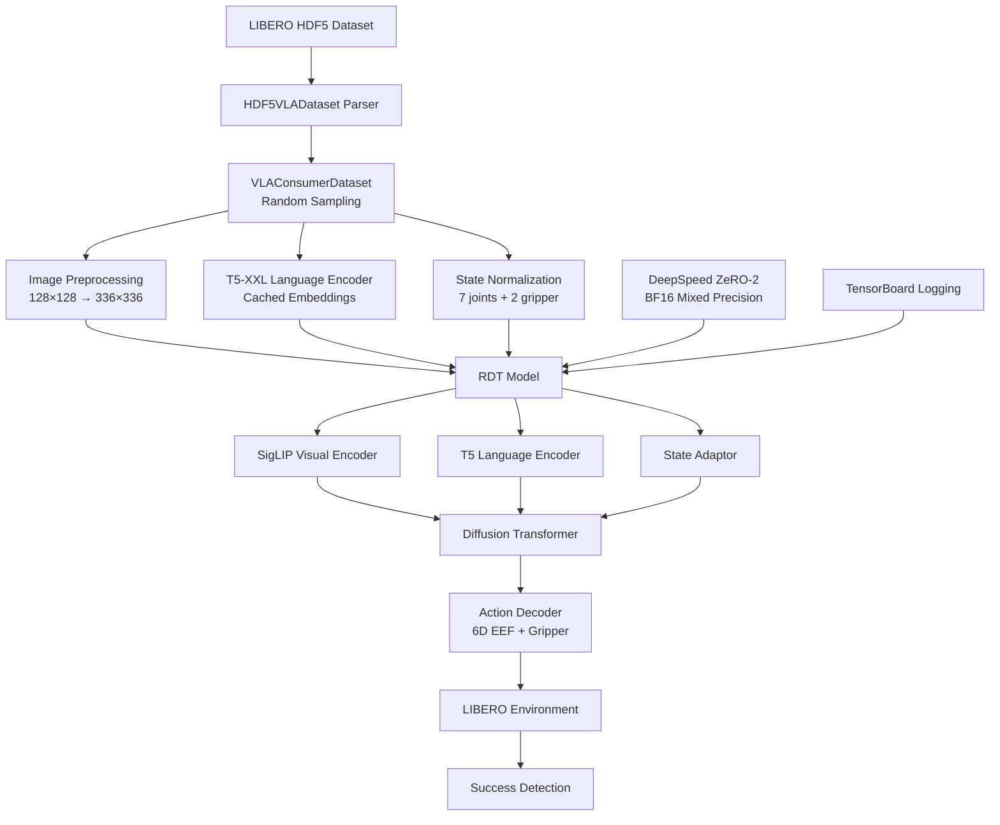

# RDT SFT & Evaluation on LIBERO: Full-parameter vs LoRA

**中文简介：** 在LIBERO仿真中对Robotics Diffusion Transformer（RDT）进行监督微调，对比全参数与LoRA方法、评估数据规模对多任务模仿学习成功率的影响。实现完整的数据预处理→训练→评估pipeline，包括HDF5解析、SigLIP图像归一化、T5-XXL语言嵌入缓存（加速30%）、DeepSpeed分布式训练、以及批量checkpoint评估工具。发现LoRA上限仅~20%远低于全参数76%+；推理耗时375ms/step占评估69%时间；扩散步数和动作块长度对成功率有显著影响。

---

**Organization:** PKU Lingchu Lab  
**Duration:** 2024  
**Role:** Research Intern  
**Stack:** PyTorch, DeepSpeed, LIBERO, peft (LoRA), T5-XXL, SigLIP

## Context & Goal

**Robotics Diffusion Transformer (RDT)** is a vision-language-action model that uses diffusion-based action generation for robot manipulation. Evaluating RDT on standardized benchmarks like **LIBERO** is critical for understanding:

1. **Fine-tuning method trade-offs:** Full-parameter vs. LoRA (parameter-efficient)
2. **Data scale effects:** How many demonstrations needed for acceptable performance
3. **Language-conditioned manipulation:** Multi-task generalization under complex natural language instructions

**Project Goal:**

Build complete supervised fine-tuning (SFT) and evaluation pipeline for RDT on LIBERO to:

1. Implement full-parameter and LoRA fine-tuning with DeepSpeed distributed training
2. Evaluate success rate across LIBERO task suites (Spatial, Object, Goal, Long)
3. Profile inference bottlenecks and tune hyperparameters (diffusion steps, action chunk length)
4. Analyze failure modes (language ambiguity, small-sample overfitting, LoRA limitations)
5. Establish reproducible experiment workflow with config management and batch evaluation tools

## System Overview

The RDT pipeline consists of four layers: data preprocessing, model architecture, distributed training, and systematic evaluation.

  
*Figure 1: End-to-end RDT training and evaluation pipeline on LIBERO*

### Architecture Flow



### Data Layer

**LIBERO Dataset Format (HDF5):**

- **Multi-view Images:** `cam_high`, `cam_left_wrist` (128×128 RGB numpy arrays)
- **Robot State:** 7-DoF joint positions + 2D gripper travel (left/right finger positions)
- **Actions:** 6D end-effector delta (x,y,z position + roll,pitch,yaw orientation in meters/radians) + gripper command (open/close binary)
- **Language Instructions:** Natural language task descriptions (e.g., "pick up the red block and place it in the drawer")

**Preprocessing Pipeline:**

1. **`HDF5VLADataset`:** Parses LIBERO HDF5 files; extracts trajectories with `parse_hdf5_file()`
2. **`VLAConsumerDataset`:** Randomly samples timesteps from trajectories; implements trajectory-length weighted sampling for balanced data distribution
3. **Image Processing:**
   - Pad 128×128 images to 336×336 (SigLIP standard input size)
   - Normalize pixel values to SigLIP mean/std
   - Augmentation: random horizontal flip, color jitter
4. **Language Embedding Cache:**
   - Precompute T5-XXL embeddings for all instructions
   - Cache to disk to avoid redundant encoding
   - Speedup: ~30% training time reduction

### Model Layer (RDT Architecture)

**Components:**

- **SigLIP Visual Encoder:** Processes 336×336 RGB images from multiple camera views
- **T5 Language Encoder:** Encodes natural language instructions to embeddings
- **State Adaptor:** Projects robot proprioceptive state (joints, gripper) to latent space
- **Diffusion Transformer:** Fuses multimodal features (vision, language, state) and generates action distribution
- **Action Decoder:** Converts diffusion output to executable actions (6D EEF delta + gripper)

**Fine-tuning Modes:**

1. **Full-Parameter Fine-tuning:**
   - Train all model parameters end-to-end
   - High capacity but requires more compute and data
   
2. **LoRA Fine-tuning (via peft library):**
   - Inject low-rank adapters into selected modules
   - Configurable `target_modules`: `all`, `adaptor_only`, `cross_attn`, `adaptor_cross`, etc.
   - Tunable hyperparameters: rank (8-32), alpha, dropout

### Training Layer

**Training Script:** `main_sft.py`

**Key Features:**

- **DeepSpeed ZeRO-2:** Distributed training with optimizer state partitioning
- **BF16 Mixed Precision:** Reduce memory footprint and improve throughput
- **Data Augmentation:** Random image flips, state noise injection
- **Sampling Validation:** Periodically sample from model to verify action distribution
- **TensorBoard Logging:** Track loss, learning rate, gradient norms

**Configuration Management:**

- Hyperparameters passed via bash scripts (e.g., `train_libero_object.sh`)
- Auto-generate timestamped experiment directories
- Save full config snapshot (`config.txt`) to each experiment dir
- Support checkpoint resume with `--resume` flag

### Evaluation Layer

**Evaluation Script:** `libero_rdt_eval.py`

**Workflow:**

1. Load model checkpoint from experiment directory
2. Initialize LIBERO simulation environment
3. Run N trials per task (typically 5 trials/task)
4. Compute per-task success rate
5. Output CSV with per-episode results
6. Profile inference and environment stepping time

**Batch Evaluation Tools:**

- **`batch_eval_checkpoints.sh`:** Evaluate multiple checkpoints in parallel
- **`analyze_checkpoints.py`:** Aggregate results across checkpoints; plot success rate vs. training step curves

**Profiler:**  
Measures and logs per-step timing breakdown:
- Model inference time (forward pass + diffusion sampling)
- Environment stepping time (physics simulation)
- Overhead (observation processing, action clipping)

## Key Challenges

### 1. Data Heterogeneity & State-Action Alignment

**Problem:**  
LIBERO dataset format differs from RDT pretraining data:

- **Image size:** LIBERO uses 128×128; RDT expects 336×336 (SigLIP standard)
- **State space:** LIBERO has 7 joint angles + 2 gripper travel values; RDT pretraining uses different joint-angle indexing
- **Action space:** LIBERO uses 6D EEF deltas (meters/radians) + discrete gripper; RDT unified action space requires remapping

**Root Cause:**  
RDT was pretrained on heterogeneous datasets with varying state/action representations. Each downstream benchmark requires custom index mapping and normalization.

**Solution Implemented:**  
Configured `UNI_STATE_INDICES` for LIBERO-specific state-action mapping:
- State indices: joint angles `[0,7)` + normalized gripper travel `[10,12)`
- Action indices: 6D EEF delta `[39,45)` + gripper command `[10]`
- Normalized gripper travel to `[0,1]` via min/max scaling

### 2. Language Ambiguity Under Limited Demonstrations

**Problem:**  
Similar task instructions (e.g., "place the block next to the ramekin" vs. "place the block on the ramekin") cause semantic confusion when training data is limited.

**Impact:**  
Task 8 ("next to the plate") achieved 0% success rate across 5 trials. Analysis revealed both source and target objects mentioned "plate" in instruction, causing policy confusion about which object to manipulate.

**Implication:**  
Language grounding requires sufficient demonstrations to disambiguate spatial relationships ("next to" vs. "on") and object references under visually similar scenes.

### 3. Small-Sample Overfitting

**Problem:**  
Training on single demonstration (`demo_0`) causes rapid overfitting:
- Training loss converges after 1000+ epochs
- Validation success rate plateaus at ~20%
- Policy fails to generalize to slight variations in object poses or scene configurations

**Root Cause:**  
Single trajectory provides insufficient coverage of state-action space. Model memorizes specific pixel patterns and joint sequences without learning robust task semantics.

**Mitigation:**  
Requires full demonstration set (typically 50-100 demos per task) for acceptable generalization.

### 4. LoRA Performance Ceiling

**Problem:**  
Under full LIBERO demonstration data, LoRA fine-tuning achieves maximum ~20% success rate, far below full-parameter fine-tuning (76%+ on Spatial suite).

**Hypothesis:**  
Low-rank constraint limits model capacity to adapt diffusion decoder and state adaptor for LIBERO-specific action distribution. LoRA rank 8-32 may be insufficient for 6D EEF + gripper control requiring high-dimensional action manifold learning.

**Open Question:**  
Does scaling LoRA rank (64, 128) close the gap? Or is full fine-tuning of specific modules (adaptor, decoder) necessary?

### 5. Evaluation Inefficiency

**Problem:**  
Single-step model inference takes ~375 ms on A100 GPU, dominating evaluation time:
- Inference: 375 ms (~69% of total eval time per step)
- Environment stepping: ~170 ms (~31%)
- Effective evaluation throughput: ~2 steps/second

**Impact:**  
Evaluating one checkpoint across 10 tasks × 5 trials × 200 steps/episode = 10,000 steps takes ~1 hour. Systematic checkpoint sweeps and ablation studies become time-prohibitive.

**Bottleneck Analysis:**  
Diffusion sampling requires multiple neural network forward passes (H steps, default 8-10). Each forward pass invokes:
- SigLIP visual encoding (multi-view images)
- T5 language encoding (instruction text)
- Diffusion transformer denoising step

## What I Built

Below is a breakdown of pipeline components and my specific contributions:

| Component | Function | My Contribution |
|-----------|----------|-----------------|
| **HDF5VLADataset** | Parse LIBERO HDF5 files, extract trajectories | Implemented `parse_hdf5_file()`; trajectory-length weighted sampling |
| **VLAConsumerDataset** | Random timestep sampling, batching | Implemented random sampling with padding/normalization |
| **Image Preprocessing** | Resize 128×128 → 336×336, normalize to SigLIP | Implemented padding and augmentation pipeline (flips, color jitter) |
| **Language Embedding Cache** | Precompute T5-XXL embeddings | Implemented disk caching; achieved ~30% training speedup |
| **State-Action Mapping** | Map LIBERO state/action to RDT indices | Configured `UNI_STATE_INDICES`: state `[0,7)` joints + `[10,12)` gripper; action `[39,45)` EEF + `[10]` gripper |
| **Gripper Normalization** | Normalize gripper travel to [0,1] | Implemented min/max scaling for 2D gripper positions |
| **LoRA Integration** | Parameter-efficient fine-tuning | Integrated peft==0.10.0; configurable target modules (attention, FFN, adaptor) |
| **LoRA Hyperparameter Tuning** | Optimize rank, alpha, dropout | Tested rank 8-32, various alpha values and dropout rates |
| **Training Script** | DeepSpeed distributed training | Implemented `main_sft.py` with ZeRO-2, BF16, augmentation, logging |
| **Config Management** | Bash script-driven experiments | Auto-generate experiment dirs; save config snapshots |
| **Checkpoint Resume** | Continue training from saved state | Implemented `--resume` flag with checkpoint loading |
| **Evaluation Script** | Run LIBERO tasks with trained models | Built `libero_rdt_eval.py`: auto-load checkpoint, run N trials/task, output CSV |
| **Profiler** | Measure inference and env stepping time | Implemented timing breakdown; identified 375ms inference, 69% eval-time share |
| **Batch Evaluation** | Evaluate multiple checkpoints in parallel | Built `batch_eval_checkpoints.sh` wrapper script |
| **Result Analysis** | Aggregate and visualize results | Implemented `analyze_checkpoints.py`: plot success vs. training step |

**Key Engineering Deliverables:**

- **Complete data preprocessing pipeline:** LIBERO HDF5 → RDT input format with image padding (128×128 → 336×336), state remapping, and cached language embeddings
- **Full-parameter fine-tuning:** End-to-end training on LIBERO with DeepSpeed ZeRO-2, BF16, data augmentation
- **LoRA integration:** Parameterized LoRA injection with configurable target modules (attention/FFN/adaptor) via peft library; tested rank 8-32
- **State-action mapping:** Configured `UNI_STATE_INDICES` for LIBERO: state (7 joints + 2 gripper) → indices `[0,7)` and `[10,12)`; action (6D EEF + gripper) → indices `[39,45)` and `[10]`
- **Evaluation infrastructure:** Built `libero_rdt_eval.py` with profiler, CSV logging, and video recording; batch evaluation tools for checkpoint comparison
- **Performance profiling:** Measured inference latency (375ms/step on A100) and identified bottleneck (69% of eval time)
- **Hyperparameter ablations:** Tuned diffusion steps H (1→8) and action chunk length N (1→10) on libero_object; documented 78%→88%→90% improvement

## Reproducibility & Experiment Hygiene

### Configuration Management

**Config-Driven Experiments:**

All training runs use bash script wrappers that pass hyperparameters to Python:

```bash
# train_libero_object.sh (example structure)
python main_sft.py \
    --data_path {{LIBERO_DATA_PATH}} \
    --task_suite libero_object \
    --batch_size {{BATCH_SIZE}} \
    --learning_rate {{LEARNING_RATE}} \
    --num_epochs {{NUM_EPOCHS}} \
    --output_dir experiments/libero_object_{{TIMESTAMP}} \
    --deepspeed_config configs/deepspeed_zero2.json \
    --seed 42
```

**Experiment Directory Auto-generation:**

- Timestamped directories prevent overwrite: `experiments/libero_object_20240315_143022/`
- Full config snapshot saved: `config.txt` contains all hyperparameters
- Checkpoint versioning: `checkpoint-{step}.pt` with step number

### Deterministic Seeding

**Fixed Random Seed:** 42

```python
import random
import numpy as np
import torch

random.seed(42)
np.random.seed(42)
torch.manual_seed(42)
torch.cuda.manual_seed_all(42)
# Note: Full determinism not guaranteed on GPU due to non-deterministic CUDA ops
```

### Dependency Management

**Environment Specification:**

Dependencies recorded in `environment.yml` or `requirements.txt`:

```yaml
# Key dependencies (versions to be specified)
pytorch: {{PYTORCH_VERSION}}
peft: 0.10.0
deepspeed: {{DEEPSPEED_VERSION}}
transformers: {{TRANSFORMERS_VERSION}}
libero: {{LIBERO_VERSION}}
```

**Python:** 3.10 (recommended for compatibility)

### Logging & Monitoring

**DeepSpeed Logs:**
- Training loss, learning rate schedule, gradient norms
- GPU memory usage, throughput (samples/second)
- NCCL debug info for distributed training diagnostics

**TensorBoard:**
- Real-time loss curves
- Validation metrics (if enabled)
- Hyperparameter tracking

**Checkpoint Integrity:**
- Verify checkpoint file size and SHA256 hash
- Log model parameter count at save time
- Test checkpoint loading before long evaluation runs

## Results

### Success Rates by Task Suite

Evaluation protocol: 5 trials per task, success detection via LIBERO built-in task checkers.

| Task Suite | Success Rate | Checkpoint | Trials | Notes |
|------------|--------------|------------|--------|-------|
| **libero_object** | **92%** | checkpoint-40000 | 5/task | H=8, N=10 (tuned) |
| **libero_goal** | **94%** | checkpoint-30000 | 5/task | Best performing suite |
| **libero_spatial** | **76%** | checkpoint-22000 | 5/task | Spatial reasoning challenges |
| **libero_long** | **38%** | checkpoint-38000 | 5/task | Long-horizon task difficulty |

*Table 1: RDT full-parameter fine-tuning results on LIBERO task suites*

**Analysis:**

- **Goal suite (94%):** Tasks with clear object manipulation goals perform best
- **Object suite (92%):** Strong performance after hyperparameter tuning (H=8, N=10)
- **Spatial suite (76%):** Spatial relationship understanding (e.g., "next to", "between") more challenging
- **Long suite (38%):** Long-horizon tasks (5+ subtasks) reveal credit assignment and temporal reasoning limitations

**Language Confusion Example:**  
Task 8 ("place the block next to the plate") achieved 0% success across 5 trials. Root cause: both source object and target reference mention "plate" in instruction, causing ambiguity in language grounding without sufficient demonstrations.

### Full-Parameter vs LoRA Comparison

| Method | Success Rate Range | Trainable Params | Training Time | Memory |
|--------|---------------------|------------------|---------------|--------|
| **Full-Parameter** | 76% - 94% (task-dependent) | {{PARAMS_TOTAL}}M | {{TRAIN_TIME_FULL}}h | {{MEM_FULL}}GB |
| **LoRA (rank 8-32)** | ~20% (upper bound) | {{PARAMS_LORA}}M | {{TRAIN_TIME_LORA}}h | {{MEM_LORA}}GB |

*Table 2: Fine-tuning method comparison on full LIBERO demonstration data*

**Critical Finding:**  
LoRA achieves only ~20% success rate maximum across tested configurations (rank 8-32, various target modules), far below full-parameter performance (76%+). This represents a 56-74 percentage point gap.

  
*Figure 2: Success rate vs. training steps for full-parameter vs. LoRA fine-tuning*

## Full vs LoRA Trade-off Analysis

### Why LoRA Underperforms

**Hypothesis 1: Insufficient Rank Capacity**

- Tested ranks: 8, 16, 32
- LoRA approximates weight updates as \( \Delta W = BA \) where \( B \in \mathbb{R}^{d \times r}, A \in \mathbb{R}^{r \times k} \)
- For 6D EEF control + gripper requiring high-dimensional action manifold, rank 32 may be insufficient

**Hypothesis 2: Suboptimal Module Selection**

- Tested `target_modules`: `all`, `adaptor_only`, `cross_attn`, `adaptor_cross`
- May need to target diffusion decoder specifically (currently not isolated)
- Action decoder may require full fine-tuning (not just low-rank adaptation)

**Hypothesis 3: Diffusion Model Architecture Mismatch**

- LoRA designed for autoregressive transformers (LLMs)
- Diffusion transformers iterate over noise levels; low-rank adapters may not capture denoising dynamics effectively
- May need full fine-tuning of diffusion layers while keeping encoders frozen

### Proposed Experiments to Test Next

1. **Rank Scaling Study:**
   - Test LoRA rank 64, 128, 256
   - Measure success rate vs. rank; identify saturation point
   - Compare training time vs. full fine-tuning

2. **Module-Specific LoRA:**
   - Apply LoRA only to diffusion decoder (freeze encoders + adaptor)
   - Apply LoRA only to state adaptor + action decoder (freeze vision/language)
   - Measure per-module contribution to performance

3. **Hybrid Strategies:**
   - Full fine-tune adaptor + LoRA on diffusion decoder
   - Full fine-tune diffusion decoder + freeze encoders
   - Measure trade-off: performance vs. trainable parameters

4. **LoRA Initialization:**
   - Initialize LoRA matrices with SVD of full fine-tuning weight deltas
   - Test if warm-start improves convergence

5. **Diffusion-Specific Adapters:**
   - Replace LoRA with diffusion-aware adapters (e.g., condition on noise level)
   - Test if architecture-specific adaptation outperforms generic LoRA

## Profiler Findings & Evaluation Efficiency

### Latency Breakdown

**Per-Step Timing (A100 GPU):**

| Component | Time (ms) | Percentage | Notes |
|-----------|-----------|------------|-------|
| **Model Inference** | **~375 ms** | **~69%** | Forward pass + diffusion sampling (H=8 steps) |
| Environment Stepping | ~170 ms | ~31% | LIBERO physics simulation (CPU-bound) |
| **Total per Step** | **~545 ms** | **100%** | Effective throughput: ~2 steps/second |

*Table 3: Profiler breakdown showing inference dominates evaluation time*

  
*Figure 3: Pie chart showing inference (69%) vs. environment (31%) time distribution*

**Bottleneck Analysis:**

Inference time (375 ms) dominated by:

1. **Diffusion sampling (H=8 iterations):** Each denoising step requires full transformer forward pass
2. **Multi-view image encoding:** SigLIP encoder processes 2 camera views (cam_high, wrist) per step
3. **Transformer backbone:** Large model ({{MODEL_SIZE_GB}}GB) with attention operations

**Impact on Evaluation:**

- Single task (10 episodes, ~200 steps/episode): ~30 minutes
- Full task suite (10 tasks × 5 trials): ~25 hours
- Checkpoint sweep (10 checkpoints): ~250 hours (10+ days)

### Proposed Acceleration Strategies

1. **Reduce Diffusion Steps:**
   - Test H=4, H=2, H=1 (DDIM fast sampling)
   - Measure success rate vs. latency trade-off
   - Expected speedup: 2-8× depending on H

2. **Encoder Caching:**
   - Cache language embeddings (already done: ~30% speedup ✅)
   - Cache visual features for static camera views (if applicable)
   - Recompute only when observations change significantly

3. **Model Distillation:**
   - Distill diffusion model to smaller student ({{STUDENT_SIZE}}B params)
   - Train student to match full model action distribution
   - Expected speedup: 3-5× with minimal accuracy loss

4. **Batch Inference:**
   - Process multiple environments in parallel on single GPU
   - Amortize encoder overhead across batch
   - Expected speedup: 2-3× for batch size 4-8

5. **Model Compilation:**
   - Use `torch.compile()` or TorchScript for kernel fusion
   - Expected speedup: 1.5-2× from operator optimization

6. **Quantization:**
   - Apply INT8 or FP16 quantization to encoders
   - Measure accuracy vs. latency trade-off
   - Expected speedup: 1.5-2× with <5% accuracy loss

## Ablation & Hyperparameter Tuning

### Diffusion Steps (H) vs Success Rate

**Experiment:** libero_object task suite, vary diffusion sampling steps H

| Diffusion Steps (H) | Success Rate | Notes |
|---------------------|--------------|-------|
| H=1 | 78% | Fast sampling but lower quality |
| H=8 | 88% | Good balance (+10% over H=1) |
| H=10 | {{SUCCESS_H10}}% | Diminishing returns expected |

*Table 4: Diffusion steps H impact on success rate (libero_object)*

**Finding:**  
Increasing H from 1 to 8 improves success rate by 10 percentage points (78% → 88%). This validates that diffusion sampling quality directly impacts task success.

**Trade-off:**  
H=8 requires 8× more inference time than H=1. For evaluation efficiency, H=4 may offer better balance (pending experiment).

### Action Chunk Length (N) vs Success Rate

**Experiment:** libero_object task suite, vary action chunk length N (actions generated per inference call)

| Action Chunk (N) | Success Rate | Notes |
|------------------|--------------|-------|
| N=1 | 78% | Per-step inference |
| N=10 | 90% | Chunk-based control (+12% over N=1) |

*Table 5: Action chunk length N impact on success rate (libero_object)*

**Finding:**  
Generating 10-step action sequences (N=10) improves success from 78% to 90% (+12 percentage points). Longer action chunks provide:
- Temporal consistency (avoid per-step jitter)
- Reduced inference overhead (10× fewer model calls)
- Smoother trajectories for manipulation

**Current Best Configuration:**  
H=8 (diffusion steps), N=10 (action chunk) achieves 92% on libero_object (after checkpoint-40000).

  
*Figure 4: Heatmap showing success rate vs. (H, N) parameter combinations*

## Failure Modes & Debugging Notes

Based on systematic evaluation and debugging across LIBERO task suites:

1. **Language Grounding Ambiguity**
   - **Symptom:** Policy ignores instruction; manipulates wrong object (0% success on specific tasks)
   - **Example:** Task 8 ("next to the plate") - both source and target mention "plate" → confusion
   - **Diagnostic:** Compare success rate on single-object vs. multi-object-reference instructions
   - **Fix:** Augment training data with unambiguous instructions; increase demonstration count for ambiguous cases

2. **Spatial Relationship Failure**
   - **Symptom:** Policy places object in wrong spatial relation ("on" instead of "next to")
   - **Root Cause:** Insufficient demonstrations for spatial preposition grounding ("next to", "between", "above")
   - **Diagnostic:** Visualize predicted vs. ground-truth placement in video recordings
   - **Fix:** Overweight training loss on spatial tasks; add geometric constraints to action decoder

3. **Long-Horizon Credit Assignment**
   - **Symptom:** First 3-4 subtasks succeed, final subtask fails consistently (38% on libero_long)
   - **Root Cause:** Diffusion model optimizes per-timestep loss; no explicit long-term goal tracking
   - **Diagnostic:** Analyze failure point histogram across episodes
   - **Fix:** Add hierarchical policy (high-level planner + low-level controller); use goal-conditioned RL for long tasks

4. **Overfitting on Single Demonstration**
   - **Symptom:** Training loss converges after 1000+ epochs, validation success plateaus at ~20%
   - **Root Cause:** Memorization of specific pixel patterns and joint trajectories from single demo
   - **Diagnostic:** Compare training vs. validation loss divergence; visualize action distribution diversity
   - **Fix:** Use full demonstration set (50-100 demos); early stopping based on validation metric

5. **Gripper Control Oscillation**
   - **Symptom:** Gripper opens/closes repeatedly without stable grasp
   - **Root Cause:** Gripper command prediction near decision boundary (0.4-0.6 instead of binary 0/1)
   - **Diagnostic:** Log gripper command distribution; check for multi-modal distribution
   - **Fix:** Apply hysteresis to gripper commands; use separate loss weight for gripper vs. EEF actions

6. **Environment Stepping Timeout**
   - **Symptom:** Episode hangs mid-execution; no state update from LIBERO
   - **Root Cause:** LIBERO simulation occasionally deadlocks (rare bug in physics engine)
   - **Diagnostic:** Monitor episode step count vs. wall-clock time; detect stalls
   - **Fix:** Add per-step timeout (5s); restart environment on timeout; log failed episodes for debugging

7. **LoRA Rank Saturation**
   - **Symptom:** Increasing LoRA rank from 16 to 32 shows no success rate improvement
   - **Root Cause:** Rank 16 already saturates low-rank subspace for current target modules; bottleneck is module selection not rank
   - **Diagnostic:** Compare LoRA weight singular values; check for rank deficiency
   - **Fix:** Target different modules (diffusion decoder specifically); try hybrid full+LoRA strategy

8. **Multi-GPU Data Imbalance**
   - **Symptom:** GPU 0 has higher memory usage than others; training slower than expected
   - **Root Cause:** Trajectory-length weighted sampling causes batch imbalance across GPUs
   - **Diagnostic:** Log batch size and sequence length distribution per GPU
   - **Fix:** Implement balanced sampling across GPUs; use DeepSpeed pipeline parallelism for large models

## Next Steps

Below are concrete experiment plans addressing the three main open problems:

### Problem 1: LoRA Underperforms Full-Parameter (20% vs 76%+)

**Hypothesis Testing Roadmap:**

1. **Rank Scaling Experiment:**
   - Test LoRA rank: 64, 128, 256
   - Measure success rate vs. trainable parameters vs. training time
   - Expected outcome: Identify if rank is bottleneck or if module selection matters more

2. **Module Targeting Ablation:**
   - Configuration A: LoRA on attention layers only
   - Configuration B: LoRA on FFN layers only
   - Configuration C: LoRA on adaptor + decoder only (freeze vision/language)
   - Configuration D: Full fine-tune adaptor, LoRA on decoder
   - Measure success rate for each configuration

3. **Hybrid Strategy:**
   - Full fine-tune: state adaptor ({{ADAPTOR_PARAMS}}M params)
   - LoRA on: diffusion decoder (rank 32)
   - Freeze: SigLIP, T5 encoders
   - Expected: Bridge gap between LoRA-only and full fine-tuning

4. **Diffusion-Aware Adapters:**
   - Replace LoRA with noise-level-conditioned adapters
   - Test if conditioning on diffusion timestep \( t \) improves adaptation
   - Compare against standard LoRA on same parameter budget

**Success Criteria:**  
Achieve >60% success rate with <30% trainable parameters (currently LoRA at ~20% success is insufficient).

### Problem 2: RDT Inference Slow (375ms/step, 69% eval time)

**Acceleration Roadmap:**

1. **Fast Diffusion Sampling:**
   - Implement DDIM sampler with H=4, H=2, H=1
   - Measure success rate degradation vs. speedup
   - Expected: 2-8× speedup; target <100ms inference with H=2

2. **Encoder Caching Strategy:**
   - Cache language embeddings per episode (already done ✅)
   - Cache visual features when camera view is static (feasibility study needed)
   - Expected: Additional 10-20% speedup if visual caching viable

3. **Model Compilation:**
   - Apply `torch.compile()` with backend="inductor"
   - Profile kernel fusion opportunities
   - Expected: 1.5-2× speedup from operator optimization

4. **Batch Evaluation:**
   - Run 4-8 LIBERO environments in parallel on single A100
   - Batch images through SigLIP encoder
   - Expected: 2-3× throughput improvement; target <150ms per batch

5. **Quantization Study:**
   - Apply FP16 or INT8 quantization to SigLIP and T5 encoders
   - Measure accuracy vs. latency trade-off
   - Expected: 1.5-2× speedup with <5% success rate loss

**Success Criteria:**  
Achieve <100ms inference per step (3.75× speedup) while maintaining >80% success rate on libero_object.

### Problem 3: Spatial & Long-Horizon Underperformance

**Spatial Task Improvement (76% → target 90%+):**

1. **Data Augmentation for Spatial Tasks:**
   - Augment demonstrations with synthetic spatial variations
   - Randomly perturb object positions while preserving spatial relationships
   - Expected: Improve spatial reasoning generalization

2. **Explicit Spatial Grounding:**
   - Add spatial relationship classifier head (auxiliary loss)
   - Train to predict spatial relationship type ("next to", "on", "above") from vision+language
   - Use classifier to bias action generation toward correct spatial placement

3. **Spatial Curriculum Learning:**
   - Phase 1: Train on unambiguous spatial tasks
   - Phase 2: Gradually introduce ambiguous spatial instructions
   - Expected: Better spatial relationship understanding

**Long-Horizon Task Improvement (38% → target 70%+):**

1. **Hierarchical Policy:**
   - High-level: Predict subgoal sequence from language instruction
   - Low-level: RDT generates actions to reach each subgoal
   - Train with hindsight relabeling for credit assignment

2. **Explicit Subtask Segmentation:**
   - Annotate LIBERO demonstrations with subtask boundaries
   - Train policy to predict subtask transitions
   - Use subtask-aware conditioning for action generation

3. **Temporal Context Extension:**
   - Increase action history context window from {{CONTEXT_LEN}} to {{CONTEXT_LEN_EXTENDED}}
   - Test if longer memory improves long-horizon task success
   - Measure memory usage vs. performance trade-off

4. **RL Fine-tuning for Long Tasks:**
   - Use imitation learning (RDT SFT) as initialization
   - Apply RL (PPO, SAC) with sparse task success reward
   - Expected: Improve credit assignment for multi-subtask sequences

**Success Criteria:**  
Achieve >90% on spatial tasks and >70% on long-horizon tasks.

## Reproducibility Checklist

To reproduce this work, ensure:

**Environment Setup:**

```bash
# Create environment
conda create -n rdt-libero python=3.10
conda activate rdt-libero

# Install dependencies
pip install torch=={{PYTORCH_VERSION}} torchvision
pip install peft==0.10.0 deepspeed=={{DEEPSPEED_VERSION}}
pip install transformers=={{TRANSFORMERS_VERSION}}
pip install libero=={{LIBERO_VERSION}}
```

**Data Preparation:**

1. Download LIBERO dataset (HDF5 format)
2. Verify HDF5 structure: images, states, actions, language
3. Run preprocessing script to generate cached embeddings

**Training:**

```bash
# Full-parameter fine-tuning
bash scripts/train_libero_object.sh

# LoRA fine-tuning
bash scripts/train_libero_object_lora.sh --rank 32 --target_modules all
```

**Evaluation:**

```bash
# Single checkpoint evaluation
python libero_rdt_eval.py \
    --checkpoint {{CHECKPOINT_PATH}} \
    --task_suite libero_object \
    --num_trials 5 \
    --diffusion_steps 8 \
    --action_chunk 10

# Batch checkpoint evaluation
bash batch_eval_checkpoints.sh {{EXPERIMENT_DIR}}
python analyze_checkpoints.py --results_dir {{EXPERIMENT_DIR}}/eval_results
```

## Placeholder Checklist

Below are placeholders used in this document that should be filled with actual measured values:

| Placeholder | Description | How to Obtain |
|-------------|-------------|---------------|
| `{{LIBERO_DATA_PATH}}` | Path to LIBERO dataset | Dataset download location |
| `{{BATCH_SIZE}}` | Training batch size per GPU | Training config |
| `{{LEARNING_RATE}}` | Learning rate | Training config (likely 1e-4 to 5e-4) |
| `{{NUM_EPOCHS}}` | Number of training epochs | Training config |
| `{{TIMESTAMP}}` | Experiment timestamp | Auto-generated (e.g., 20240315_143022) |
| `{{PYTORCH_VERSION}}` | PyTorch version | `pip show torch | grep Version` |
| `{{DEEPSPEED_VERSION}}` | DeepSpeed version | `pip show deepspeed | grep Version` |
| `{{TRANSFORMERS_VERSION}}` | HuggingFace version | `pip show transformers | grep Version` |
| `{{LIBERO_VERSION}}` | LIBERO benchmark version | `pip show libero | grep Version` |
| `{{PARAMS_TOTAL}}` | Total model parameters | Count with `sum(p.numel() for p in model.parameters())` |
| `{{PARAMS_LORA}}` | LoRA trainable parameters | Count LoRA adapter parameters only |
| `{{TRAIN_TIME_FULL}}` | Full fine-tuning wall time | Log training start/end timestamps |
| `{{TRAIN_TIME_LORA}}` | LoRA fine-tuning wall time | Log training start/end timestamps |
| `{{MEM_FULL}}` | Peak GPU memory (full) | Monitor `nvidia-smi` during training |
| `{{MEM_LORA}}` | Peak GPU memory (LoRA) | Monitor `nvidia-smi` during training |
| `{{MODEL_SIZE_GB}}` | Model checkpoint size | Check file size of checkpoint .pt file |
| `{{SUCCESS_H10}}` | Success rate with H=10 | Run ablation experiment |
| `{{STUDENT_SIZE}}` | Distilled model size | Design distillation target (e.g., 1.0B) |
| `{{CONTEXT_LEN}}` | Current context window length | Check model config |
| `{{CONTEXT_LEN_EXTENDED}}` | Extended context length | Proposed value (e.g., 2× current) |
| `{{CHECKPOINT_PATH}}` | Path to checkpoint file | Experiment directory + checkpoint name |
| `{{EXPERIMENT_DIR}}` | Experiment output directory | Auto-generated by training script |

**Visual Asset Placeholders:**

| Figure | Description | Priority |
|--------|-------------|----------|
| `libero_pipeline.png` | Data → model → training → eval flow diagram | High |
| `libero_curve.png` | Success rate vs. training steps (full vs. LoRA) | High |
| `libero_ablation_hn.png` | Heatmap: H (diffusion steps) vs. N (action chunk) success rates | Medium |
| `libero_profiler_breakdown.png` | Pie chart: inference (69%) vs. env (31%) time | Medium |
| `libero_language_confusion.png` | Example: task 8 instruction ambiguity visualization | Low |

---

**References:**

- [RDT: Robot Diffusion Transformer](https://arxiv.org/abs/2410.07368)
- [LIBERO Benchmark](https://lifelong-robot-learning.github.io/LIBERO/)
- [LoRA: Low-Rank Adaptation](https://arxiv.org/abs/2106.09685)
- [DDIM: Denoising Diffusion Implicit Models](https://arxiv.org/abs/2010.02502)
- [DeepSpeed Documentation](https://www.deepspeed.ai/)

**Related Projects:**

- [GR00T-N1.6 on LIBERO](groot-libero-reproduction.md) - Achieved 97.8% with faster inference (50ms vs. 375ms)
- [RLinf × RDT Integration](rlinf-rdt-integration.md) - RL framework integration for pretrain → post-RL workflow
- [OptiTrack ROS2 Streaming](teleop-mocap.md) - Upstream data source for robot teleoperation
