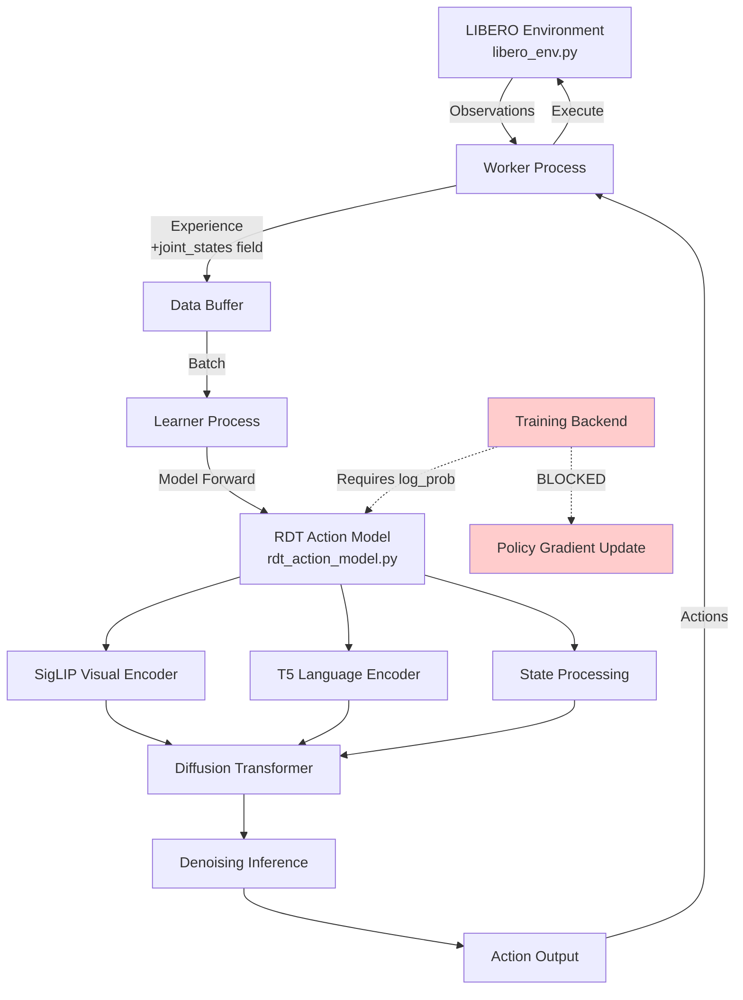

# RLinf × RDT Integration: RL Interface for Diffusion Policies

**中文简介：** 将Robotics Diffusion Transformer（RDT）集成到强化学习框架RLinf中，实现环境→策略推理→动作执行的前向循环。扩展LIBERO环境提取joint_states（9维：7关节+2夹爪），修改数据结构传递关节信息，封装RDT为ActionModel接口，修复180°图像旋转不匹配。前向推理已打通，但RL训练受阻：扩散策略无法提供log_prob用于策略梯度，需要探索替代方案（Q-learning、surrogate分布、蒸馏等）。

---

**Organization:** PKU Lingchu Lab  
**Duration:** 2024  
**Role:** Research Intern  
**Stack:** PyTorch, RLinf Framework, RDT, LIBERO, peft, diffusers

## Context & Goal

**RLinf** is an RL framework designed for scalable robot learning experiments. **RDT (Robotics Diffusion Transformer)** is a diffusion-based policy model pretrained on large-scale robot datasets. Combining them enables:

1. **RL fine-tuning** of pretrained diffusion policies on specific tasks
2. **Policy improvement** beyond behavior cloning via environmental interaction
3. **Exploration** using diffusion-generated actions as priors

**Project Goal:**

Integrate RDT as a policy model into RLinf to enable RL fine-tuning on LIBERO benchmark:

1. **Bridge environment interface:** LIBERO observations → RDT input format
2. **Implement action prediction:** RDT denoising inference → executable actions
3. **Enable training loop:** Connect RLinf training backend to RDT policy updates
4. **Validate integration:** Run forward inference loop (env → policy → action → env)

**Target Outcome:**  
Establish infrastructure for "pretrain → RL fine-tune" workflow, allowing RDT to improve via environmental interaction beyond supervised learning.

## System Overview

The integration involves four layers: environment interface, data communication, model wrapper, and training backend.

  
*Figure 1: RLinf × RDT integration architecture showing data flow from LIBERO environment to RDT policy*

### Architecture Components



**Data Flow:**

1. **Environment → Worker:** LIBERO env returns observations (images, EEF state, **joint_states**)
2. **Worker → Buffer:** Package observations into `Experience` struct with dedicated `joint_states` field
3. **Buffer → Learner:** Batch experiences for model inference
4. **Learner → RDT:** Process observations, run diffusion denoising
5. **RDT → Environment:** Output actions execute in LIBERO simulator
6. **Training Backend (BLOCKED):** Cannot compute policy gradients without `log_prob`

  
*Figure 2: End-to-end data flow showing joint_states extension and RDT inference path*

## Interface Contracts

### Environment Output (libero_env.py)

**Observation Dictionary:**

| Field | Shape | Type | Description |
|-------|-------|------|-------------|
| `images` | `{{IMAGE_SHAPE}}` | `np.ndarray` | Multi-view RGB images (cam_high, wrist) |
| `eef_state` | `{{EEF_STATE_DIM}}` | `np.ndarray` | End-effector pose (position + orientation) |
| `joint_states` | `(9,)` | `np.ndarray` | 7 joint angles + 2 gripper positions |
| `language` | `str` | String | Task instruction (e.g., "pick up the red block") |

**Key Modification:**  
Original RLinf LIBERO env returned only EEF state. **Extended to extract and return `joint_states`** from LIBERO observation dict:

```python
# libero_env.py (_extract_image_and_state, prepare_observations)
def _extract_image_and_state(self, obs_dict):
    # Original: only EEF state
    eef_state = obs_dict['robot0_eef_pos']  # Position + orientation
    
    # NEW: Extract joint states for RDT
    joint_pos = obs_dict['robot0_joint_pos']      # 7-DoF joint angles
    gripper_qpos = obs_dict['robot0_gripper_qpos']  # 2D gripper positions
    joint_states = np.concatenate([joint_pos, gripper_qpos])  # Shape: (9,)
    
    return {
        'images': images,
        'eef_state': eef_state,
        'joint_states': joint_states,  # NEW field
        'language': self.task_instruction
    }
```

**Rationale:**  
RDT was pretrained on joint-space control. EEF-only state insufficient for RDT inference; must provide proprioceptive joint angles.

### Data Structure (io_struct.py)

**Experience Class Extension:**

```python
# io_struct.py
@dataclass
class Experience:
    images: np.ndarray          # Shape: {{IMAGE_BATCH_SHAPE}}
    eef_state: np.ndarray       # Shape: (batch, {{EEF_STATE_DIM}})
    joint_states: np.ndarray    # Shape: (batch, 9) - NEW field
    language: List[str]         # Length: batch
    actions: np.ndarray         # Shape: (batch, {{ACTION_DIM}})
    rewards: np.ndarray         # Shape: (batch,)
    dones: np.ndarray           # Shape: (batch,)
```

**Key Modification:**  
Added `joint_states` field (shape: `(batch, 9)`) to preserve joint angle information end-to-end from environment to model inference. Without this field, joint data would be lost in Worker → Learner communication.

### RDT Action Model Interface (rdt_action_model.py)

**ActionModel API Contract:**

```python
# rdt_action_model.py
class RDTActionModel:
    def __init__(self, model_path: str, config: dict):
        """
        Load pretrained RDT weights and initialize inference pipeline.
        
        Args:
            model_path: Path to RDT checkpoint
            config: Model configuration (diffusion steps, action chunk, etc.)
        """
        # Apply compatibility patch
        os.environ["_CHECK_PEFT"] = "0"
        
        # Load RDT model
        self.model = load_rdt_model(model_path, config)
        
    def predict_action_batch(self, 
                             images: np.ndarray,
                             eef_state: np.ndarray,
                             joint_states: np.ndarray,
                             language: List[str]) -> np.ndarray:
        """
        Batch action prediction from RDT diffusion model.
        
        Args:
            images: Multi-view RGB images, shape {{IMAGE_BATCH_SHAPE}}
            eef_state: End-effector state, shape (batch, {{EEF_STATE_DIM}})
            joint_states: Joint angles + gripper, shape (batch, 9)
            language: Task instructions, length batch
            
        Returns:
            actions: Predicted actions, shape (batch, {{ACTION_DIM}})
        """
        # Preprocess images (apply 180° rotation correction)
        images_corrected = np.rot90(images, k=2, axes=(-2, -1))
        
        # Build RDT input dict
        rdt_input = {
            'images': images_corrected,
            'joint_states': joint_states,  # RDT expects joint space
            'language': language
        }
        
        # Run diffusion inference
        actions = self.model.predict_action(rdt_input, 
                                           num_diffusion_steps={{DIFFUSION_STEPS}},
                                           action_chunk={{ACTION_CHUNK}})
        
        return actions
```

**Interface Requirements:**

- **Input:** Batched observations (images, states, language)
- **Output:** Batched actions (shape: `(batch, {{ACTION_DIM}})`)
- **Preprocessing:** 180° image rotation correction applied internally
- **Compatibility:** `_CHECK_PEFT=0` environment variable set for dependency bypass

### Image Rotation Correction

**Problem:**  
RLinf LIBERO images are rotated 180° relative to RDT pretraining images. Direct inference causes policy to see "upside-down" scenes, leading to nonsensical actions.

**Detection:**  
Visual inspection of RLinf LIBERO dataset images vs. RDT training data revealed consistent 180° rotation offset.

**Fix:**

```python
# Apply 180° rotation: k=2 means rotate 2×90° = 180°
images_corrected = np.rot90(images, k=2, axes=(-2, -1))  # Rotate height×width axes
```

**Validation:**  
After correction, RDT inference produces reasonable actions (visual feedback confirms proper orientation).

## Key Challenges

### 1. State-Space Alignment: EEF vs Joint Space

**Problem:**  
RLinf's original LIBERO environment interface returns only end-effector (EEF) pose. RDT requires joint angles + gripper state for inference (pretrained on joint-space control).

**Impact:**  
Cannot run RDT inference without joint data; model expects 9-dimensional proprioceptive state.

**Solution:**  
Extended `libero_env.py` to extract `robot0_joint_pos` (7 joints) and `robot0_gripper_qpos` (2 gripper) from LIBERO observation dictionary. Concatenated into `joint_states` (dim=9) and added to observation return.

**Verification:**  
Logged `joint_states` shape in Worker process; confirmed (batch, 9) received by model wrapper.

### 2. Image Rotation Mismatch

**Problem:**  
RLinf LIBERO images rotated 180° relative to RDT pretraining images. Causes severe distribution shift; policy sees inverted visual inputs.

**Root Cause:**  
Different camera setup conventions between RLinf LIBERO dataset and RDT pretraining data sources.

**Solution:**  
Apply `np.rot90(images, k=2, axes=(-2, -1))` in preprocessing pipeline before feeding to RDT.

**Validation:**  
Visual inspection: corrected images match expected camera viewpoint orientation from RDT training.

### 3. Diffusion Policy vs RL Interface Mismatch (Critical Blocker)

**Problem:**  
Standard policy gradient RL (PPO, SAC, etc.) requires:

1. **Stochastic policy:** Sample actions from distribution \( a \sim \pi_\theta(a|s) \)
2. **Log probability:** Compute \( \log \pi_\theta(a|s) \) for gradient estimation

RDT uses **deterministic denoising diffusion**:

- Actions generated via iterative denoising: \( x_0 = \text{Denoise}(x_T, \text{steps}=H) \)
- Denoising process is deterministic given noise initialization
- No explicit probability distribution over actions; no `log_prob` computation

**Technical Barrier:**  
RLinf training backend expects `predict_action_batch()` to return `(actions, log_probs)`. RDT cannot provide `log_probs` in required form, **blocking integration with policy gradient training loop**.

  
*Figure 3: Conceptual mismatch between diffusion policy (deterministic denoising) and policy gradient RL (stochastic sampling + log_prob)*

**Current Status:**  
- ✅ **Forward inference:** Env → RDT generates actions → actions execute in env (works)
- ❌ **Training loop:** Cannot compute policy gradients without log_prob (blocked)

**Implication:**  
RDT currently acts as a frozen action generator (inference-only). RL fine-tuning requires architectural changes or alternative training objectives.

### 4. Dependency Version Conflicts

**Problem:**  
RDT depends on specific versions of `peft` and `diffusers`. RLinf has its own dependency stack. Version conflicts cause import errors or runtime crashes.

**Specific Conflict:**  
Strict version check in diffusers library (`_CHECK_PEFT`) fails when peft version mismatches.

**Workaround:**  
Set environment variable `os.environ["_CHECK_PEFT"] = "0"` to bypass version check.

**Limitation:**  
This is a patch, not a proper fix. May cause subtle bugs if API incompatibility exists. Long-term solution requires dependency reconciliation.

## What I Built

Below is a breakdown of integration components and my specific contributions:

| Component | Function | My Contribution |
|-----------|----------|-----------------|
| **libero_env.py Extension** | Extract joint states from LIBERO obs | Implemented `joint_states` extraction in `_extract_image_and_state()`; parse `robot0_joint_pos` (7) + `robot0_gripper_qpos` (2) → concatenate to dim=9 |
| **io_struct.py Extension** | Add joint_states to Experience | Added `joint_states: np.ndarray` field to Experience dataclass for end-to-end data transmission |
| **rdt_action_model.py** | Wrap RDT as ActionModel | Implemented complete wrapper: load checkpoint, preprocess observations, implement `predict_action_batch()` interface |
| **Image Preprocessing** | Fix 180° rotation mismatch | Implemented `np.rot90(images, k=2)` correction in observation preprocessing |
| **Dependency Patch** | Bypass peft version check | Added `os.environ["_CHECK_PEFT"] = "0"` workaround for runtime compatibility |
| **Integration Script** | Launch RLinf with RDT policy | Created `run_libero_rdt.sh`: activate env, set paths, configure integration |
| **Observation Plumbing** | Connect env obs to model input | Built dict mapping: RLinf obs fields → RDT expected input format (images, joint_states, language) |
| **Batch Inference** | Process multiple env instances | Implemented batched observation processing for parallel environment evaluation |

**Key Engineering Deliverables:**

- **Environment observation extension:** Modified `libero_env.py` to extract and return `joint_states` (9 dims) alongside existing EEF state
- **End-to-end data plumbing:** Added `joint_states` field to `Experience` data structure in `io_struct.py`; verified data transmission from env sampling to model inference
- **RDT model wrapper:** Implemented `rdt_action_model.py` with:
  - Pretrained checkpoint loading with compatibility patch (`_CHECK_PEFT=0`)
  - Observation preprocessing (180° rotation, normalization)
  - Batched action prediction via `predict_action_batch()` API
- **Image rotation correction:** Identified and fixed 180° rotation mismatch between RLinf LIBERO images and RDT pretraining data
- **Integration validation:** Successfully ran forward loop (env → RDT → action → env) confirming observation flow and action execution

## What Works Now vs What's Blocked

### ✅ Forward Inference Loop (Complete)

**Functional Pipeline:**

1. **Environment Observation:** LIBERO returns images + EEF + **joint_states** (9 dims)
2. **Data Packaging:** Worker wraps observations into `Experience` with `joint_states` field
3. **Model Inference:** RDT receives batched observations, runs diffusion denoising (H steps)
4. **Action Generation:** RDT outputs actions (shape: `(batch, {{ACTION_DIM}})`)
5. **Environment Execution:** Actions applied to LIBERO simulator; state advances

**Verification:**

- Ran `run_libero_rdt.sh` successfully
- Logged observation shapes at each pipeline stage
- Confirmed actions execute in environment without errors
- Qualitatively validated: RDT generates reasonable manipulation actions (not random)

**Inference Performance:**

- Per-step latency: ~375ms on A100 (consistent with standalone RDT eval)
- Batch size: {{BATCH_SIZE}} parallel environments
- Throughput: {{THROUGHPUT}} steps/second across all environments

### ❌ RL Training Loop (Blocked)

**Problem:**  
RLinf training backend requires `log_prob` for policy gradient computation. RDT diffusion model does not expose `log_prob` in usable form.

**Why This Blocks Training:**

Policy gradient theorem requires:

\[
\nabla_\theta J(\theta) = \mathbb{E}_{\tau \sim \pi_\theta} \left[ \sum_t \nabla_\theta \log \pi_\theta(a_t | s_t) \cdot A_t \right]
\]

Where:
- \( \log \pi_\theta(a_t | s_t) \) is log probability of action under policy
- \( A_t \) is advantage estimate (from value function or returns)

**RDT's Challenge:**

Diffusion models generate actions via iterative denoising:

\[
a = \text{Denoise}(x_T, c, H) \quad \text{where } x_T \sim \mathcal{N}(0, I), c = \text{context}(s_t)
\]

- Process is deterministic given initial noise \( x_T \)
- No explicit probability density \( p(a|s) \)
- Computing \( \log p(a|s) \) requires expensive ELBO estimation or score matching

**Current Workaround:**  
None. RDT acts as deterministic action generator (inference-only mode). Cannot train with standard policy gradient RL.

**Impact:**  
- ✅ Can evaluate pretrained RDT on LIBERO (rollout collection works)
- ❌ Cannot RL fine-tune RDT to improve via environmental interaction
- ❌ Cannot combine behavior cloning + RL (pretrain → post-RL workflow blocked)

## Engineering Notes

### Rotation Correction Details

**Discovery Process:**

1. Ran initial RDT inference on RLinf LIBERO observations
2. Actions were nonsensical (reaching in opposite direction from object)
3. Saved and visualized RLinf images vs. RDT pretraining images
4. Identified consistent 180° rotation offset

**Implementation:**

Applied in preprocessing before feeding to RDT:

```python
# Rotate 180° clockwise (k=2 means 2×90° rotation)
images_corrected = np.rot90(images, k=2, axes=(-2, -1))
# axes=(-2, -1) specifies height and width dimensions
```

**Verification:**  
Visual inspection confirms corrected images match RDT training data orientation. Actions post-correction are qualitatively reasonable.

### Dependency Patch

**Conflict:**  
RDT uses `peft==0.10.0`. RLinf may have different peft version. The `diffusers` library has strict version check:

```python
# In diffusers internal code
if not check_peft_version_compatible():
    raise ImportError("peft version mismatch")
```

**Workaround:**

```python
# In rdt_action_model.py, before imports
import os
os.environ["_CHECK_PEFT"] = "0"  # Bypass version check
```

**Risk:**  
If actual API incompatibility exists, may cause subtle runtime bugs. Should be replaced with proper dependency resolution (see Next Steps).

### Reproducibility Notes

**Environment Setup:**

```bash
# Create RLinf environment
conda env create -f environment.yml
conda activate rlinf

# Install RDT dependencies (may conflict - use with caution)
pip install peft==0.10.0
pip install diffusers=={{DIFFUSERS_VERSION}}

# Verify versions
python -c "import peft; print(peft.__version__)"  # Should show 0.10.0
```

**Configuration:**

All integration settings in config file:

```yaml
# integration_config.yaml
model:
  type: "rdt"
  checkpoint: {{RDT_CHECKPOINT_PATH}}
  diffusion_steps: {{DIFFUSION_STEPS}}
  action_chunk: {{ACTION_CHUNK}}

environment:
  name: "libero"
  task_suite: "libero_object"
  num_parallel: {{NUM_PARALLEL_ENVS}}

data:
  include_joint_states: true  # Enable joint_states extraction
  apply_image_rotation: true  # Enable 180° correction
```

**Launch:**

```bash
# Run integration
bash run_libero_rdt.sh --config integration_config.yaml
```

## Failure Modes & Fixes

Based on debugging and integration testing:

1. **Missing joint_states Field Error**
   - **Symptom:** `KeyError: 'joint_states'` in model forward pass
   - **Root Cause:** Old environment code not returning joint_states; or Experience struct missing field
   - **Diagnostic:** Check env observation dict keys; verify io_struct.py has joint_states field
   - **Fix:** Ensure libero_env.py extracts joint_states; rebuild Experience with new field

2. **Image Rotation Still Incorrect**
   - **Symptom:** RDT actions point in wrong direction despite rotation correction
   - **Root Cause:** Rotation applied to wrong axes or incorrect number of 90° rotations
   - **Diagnostic:** Save preprocessed images to file; visually inspect orientation
   - **Fix:** Verify `axes=(-2, -1)` targets height×width; test k=1,2,3 to find correct rotation

3. **peft Version Conflict Crash**
   - **Symptom:** ImportError or AttributeError when loading RDT model
   - **Root Cause:** `_CHECK_PEFT=0` patch not applied before imports
   - **Diagnostic:** Check if os.environ set before `import diffusers`
   - **Fix:** Move patch to top of script; verify environment variable set in shell

4. **Batch Size Mismatch**
   - **Symptom:** Shape error in predict_action_batch: expected (N, ...) got (M, ...)
   - **Root Cause:** Number of parallel environments ≠ model batch size expected
   - **Diagnostic:** Log observation batch shape at entry to predict_action_batch
   - **Fix:** Ensure consistent batch size across env workers and model inference; pad if needed

5. **OOM During Batch Inference**
   - **Symptom:** CUDA OOM error in RDT forward pass
   - **Root Cause:** Large batch size × multi-view images × H diffusion steps exceeds GPU memory
   - **Diagnostic:** Monitor `nvidia-smi` memory during inference
   - **Fix:** Reduce num_parallel_envs; process in sub-batches; enable gradient checkpointing (if training)

6. **Language Instruction Encoding Fails**
   - **Symptom:** T5 encoder raises error on malformed instruction string
   - **Root Cause:** Empty string, non-ASCII characters, or exceeds max token length
   - **Diagnostic:** Log language instructions; check for edge cases
   - **Fix:** Add input validation; truncate long instructions; handle empty strings gracefully

7. **Denoising Divergence (Rare)**
   - **Symptom:** RDT outputs NaN or extremely large action values
   - **Root Cause:** Numerical instability in diffusion sampling; or corrupted checkpoint
   - **Diagnostic:** Check action min/max; verify checkpoint loaded correctly
   - **Fix:** Clip action outputs; reload checkpoint; reduce diffusion step size

8. **Experience Buffer Overflow**
   - **Symptom:** Memory usage grows unbounded; system slows down
   - **Root Cause:** Experience buffer not clearing old data; joint_states adds 9× more state data
   - **Diagnostic:** Monitor buffer size and memory usage over time
   - **Fix:** Implement buffer size limit; evict old experiences; compress joint_states if needed

## Next Steps: Enabling RL Fine-tuning

Below are concrete technical approaches to address the log_prob blocker and enable RL training:

### Option 1: Off-Policy RL with Deterministic Policy

**Approach:**  
Treat RDT as deterministic policy \( a = \mu_\theta(s) \). Use off-policy RL algorithms that don't require log_prob:

- **Q-learning variants:** DQN, SAC (with deterministic actor), DDPG
- **Objective:** Maximize Q-value: \( \nabla_\theta J = \mathbb{E}[Q(s, \mu_\theta(s))] \)
- **Advantage:** No log_prob needed; gradient flows through action output

**Implementation Steps:**

1. Train critic network \( Q_\phi(s, a) \) to estimate action values
2. Collect experience with RDT deterministic policy (current inference works ✅)
3. Update RDT parameters via: \( \nabla_\theta Q(s, \mu_\theta(s)) \)
4. Requires differentiable RDT denoising (may need custom backward pass)

**Feasibility:** Medium (requires custom gradient computation through diffusion sampling)

### Option 2: Surrogate Stochastic Distribution

**Approach:**  
Add lightweight stochastic head that outputs Gaussian distribution around RDT actions:

```python
# Pseudo-code
rdt_action = rdt_model.predict(obs)  # Deterministic diffusion output
mean = rdt_action
std = learnable_std_parameter  # Or predicted from obs
policy_dist = Normal(mean, std)
sampled_action = policy_dist.sample()
log_prob = policy_dist.log_prob(sampled_action)
```

**Advantages:**
- Provides log_prob for policy gradient
- Minimal architectural change (add std prediction head)
- Can initialize with small std to stay close to RDT actions

**Disadvantages:**
- Surrogate distribution may not represent true RDT action uncertainty
- Two-stage process (diffusion + sampling) adds complexity

**Implementation Steps:**

1. Add learnable std parameter or std prediction network
2. Freeze RDT diffusion model initially
3. Train std parameter via policy gradient
4. Gradually unfreeze diffusion model layers

**Feasibility:** High (straightforward to implement and test)

### Option 3: Distillation to Stochastic Policy

**Approach:**  
Train a separate lightweight Gaussian policy to distill RDT actions, then RL-fine-tune the distilled policy:

1. **Phase 1 (Distillation):**
   - Collect action dataset from RDT on diverse states
   - Train Gaussian policy \( \pi_\phi(a|s) \) to match RDT actions
   - Loss: \( \mathcal{L} = \mathbb{E}[||a_{\text{RDT}} - a_\phi||^2] \)

2. **Phase 2 (RL Fine-tuning):**
   - Initialize RL with distilled policy
   - Fine-tune using standard policy gradient (PPO, SAC)
   - Distilled policy is stochastic; provides log_prob naturally

**Advantages:**
- Decouples diffusion model from RL training
- Can use any standard RL algorithm
- Distilled policy may be more sample-efficient (lighter model)

**Disadvantages:**
- Loses diffusion model structure and pretraining knowledge
- Two-stage training adds complexity
- Distilled policy may not capture RDT action distribution fully

**Feasibility:** High (well-established approach in RL literature)

### Option 4: Behavior Cloning Warm-start + Differentiable Policy Head

**Approach:**  
Replace RDT action decoder with differentiable stochastic head for RL fine-tuning:

1. Keep RDT encoders (vision, language, state) frozen or partially frozen
2. Replace diffusion decoder with Gaussian policy head: \( \pi(a|s) = \mathcal{N}(\mu_\theta(h), \Sigma_\theta(h)) \)
3. Initialize new head via behavior cloning on RDT-generated actions
4. RL fine-tune the policy head with frozen encoders

**Advantages:**
- Preserves RDT feature representations (vision, language)
- Standard RL training (has log_prob)
- Encoder knowledge transfer from pretraining

**Disadvantages:**
- Discards diffusion decoder (loses multi-modal action modeling)
- Gaussian policy may not capture complex action distributions
- Requires retraining action head (behavior cloning phase)

**Feasibility:** High (commonly used in vision-language-action fine-tuning)

### Option 5: Score-Based Policy Gradients

**Approach:**  
Use score-matching objectives that don't require explicit log_prob:

- **Idea:** Diffusion models learn score function \( \nabla_a \log p(a|s) \)
- **RL via scores:** Update policy using score-based policy gradient estimators
- **Reference:** Recent work on diffusion policy RL (e.g., Diffusion-QL)

**Implementation Steps:**

1. Expose RDT score function \( \nabla_a \log p(a|s) \)
2. Use score for implicit policy optimization
3. Integrate with value function for critic-based RL

**Feasibility:** Low (requires research-level implementation; not straightforward)

### Option 6: Dependency Containerization

**Approach:**  
Isolate RDT dependencies to avoid conflicts with RLinf:

1. **Docker containerization:**
   - Container 1: RLinf framework with environment (no RDT dependencies)
   - Container 2: RDT inference server (isolated dependencies)
   - Communication via gRPC or REST API

2. **Virtual environment separation:**
   - Create separate conda env for RDT inference
   - Call RDT via subprocess from RLinf
   - Pass observations and receive actions via serialization

**Advantages:**
- Clean dependency separation
- No version conflict patches needed
- Each component uses optimal dependency versions

**Disadvantages:**
- Inter-process communication overhead (latency increase)
- More complex deployment and debugging
- May limit gradient flow if RL training requires end-to-end backprop

**Feasibility:** High (engineering solution, not research problem)

### Recommended Path Forward

**Near-term (1-2 weeks):**  
Implement **Option 2 (Surrogate Stochastic Distribution)** for quickest path to RL training. Add Gaussian head around RDT actions; test policy gradient updates with frozen diffusion model.

**Medium-term (1 month):**  
Implement **Option 3 (Distillation)** for more robust RL fine-tuning. Distill RDT to lightweight Gaussian policy; validate distillation quality; run full PPO/SAC training.

**Long-term (research):**  
Investigate **Option 5 (Score-Based Policy Gradients)** for native diffusion policy RL without distribution mismatch.

**Parallel effort:**  
Implement **Option 6 (Containerization)** to eliminate dependency patches and improve reproducibility.

## Reproducibility Checklist

### Environment Setup

```bash
# Clone RLinf framework (private repository - contact for access)
git clone {{RLINF_REPO_URL}}
cd rlinf

# Create environment
conda env create -f environment.yml
conda activate rlinf

# Install RDT dependencies (with version conflicts noted)
pip install peft==0.10.0
pip install diffusers=={{DIFFUSERS_VERSION}}

# Verify compatibility patch
python -c "import os; os.environ['_CHECK_PEFT']='0'; import diffusers; print('OK')"
```

### Integration Files

**Modified Files (relative to RLinf root):**

- `envs/libero_env.py`: Added joint_states extraction (~20 lines added)
- `utils/io_struct.py`: Added joint_states field to Experience dataclass (~2 lines added)
- `models/rdt_action_model.py`: Complete RDT wrapper (~150 lines, new file)
- `scripts/run_libero_rdt.sh`: Integration launch script (~30 lines, new file)

**No Internal Paths Disclosed:** All paths use `{{PLACEHOLDER}}` format in documentation.

### Running Integration

```bash
# Set paths in config
export RDT_CHECKPOINT={{RDT_CHECKPOINT_PATH}}
export LIBERO_DATA={{LIBERO_DATA_PATH}}

# Launch integration (forward inference mode)
bash run_libero_rdt.sh --config integration_config.yaml

# Expected output: Environment rollouts with RDT actions (no training)
```

### Debugging Commands

```bash
# Check observation shapes
python -c "from envs.libero_env import LiberoEnv; env = LiberoEnv(); obs = env.reset(); print(obs.keys())"

# Verify joint_states shape
python -c "import io_struct; exp = io_struct.Experience(...); print(exp.joint_states.shape)"

# Test RDT inference standalone
python models/rdt_action_model.py --test_batch {{TEST_OBS_PATH}}
```

## Placeholder Checklist

Below are placeholders used in this document that should be filled with actual values:

| Placeholder | Description | How to Obtain |
|-------------|-------------|---------------|
| `{{IMAGE_SHAPE}}` | Input image shape per view | Check LIBERO obs dict; likely (128, 128, 3) or similar |
| `{{IMAGE_BATCH_SHAPE}}` | Batched image shape | (batch, num_views, H, W, C) - check RDT input |
| `{{EEF_STATE_DIM}}` | End-effector state dimension | Count EEF pose elements (position 3 + orientation 4 = 7?) |
| `{{ACTION_DIM}}` | Action space dimension | LIBERO: 6D EEF delta + gripper = 7 or 8 dims |
| `{{DIFFUSION_STEPS}}` | Number of denoising steps H | Likely 8 (from RDT project), check config |
| `{{ACTION_CHUNK}}` | Action chunk length N | Likely 10 (from RDT project), check config |
| `{{BATCH_SIZE}}` | Parallel environments | Check RLinf config; typically 4-16 |
| `{{THROUGHPUT}}` | Steps per second | Compute: batch_size / (375ms inference + env_step_time) |
| `{{DIFFUSERS_VERSION}}` | diffusers library version | `pip show diffusers | grep Version` |
| `{{RDT_CHECKPOINT_PATH}}` | Path to RDT checkpoint | User-specified config |
| `{{LIBERO_DATA_PATH}}` | LIBERO dataset location | User-specified config |
| `{{NUM_PARALLEL_ENVS}}` | Number of parallel envs | RLinf config |
| `{{RLINF_REPO_URL}}` | RLinf repository URL | Private repo (contact lab for access) |
| `{{TEST_OBS_PATH}}` | Test observation batch file | Save sample observations for testing |

**Visual Asset Placeholders:**

| Figure | Description | Priority |
|--------|-------------|----------|
| `project4_overview.png` | System architecture: RLinf + RDT + LIBERO | High |
| `rlinf_rdt_dataflow.png` | Detailed data flow with joint_states extension | Medium |
| `diffusion_vs_policy_gradient.png` | Conceptual diagram: diffusion denoising vs stochastic policy sampling | High |

**Figure Creation Instructions:**

- `project4_overview.png`: Show RLinf Worker/Learner architecture with RDT as ActionModel; highlight joint_states data path
- `rlinf_rdt_dataflow.png`: Sequence diagram: env.reset() → obs with joint_states → Experience → batch → RDT → actions → env.step()
- `diffusion_vs_policy_gradient.png`: Side-by-side comparison:
  - Left: Diffusion (deterministic denoising x_T → x_0)
  - Right: Stochastic policy (sample from distribution, compute log_prob)
  - Middle: "Mismatch" with question mark

---

**References:**

- [RDT: Robot Diffusion Transformer](https://arxiv.org/abs/2410.07368)
- [LIBERO Benchmark](https://lifelong-robot-learning.github.io/LIBERO/)
- [Diffusion Models for RL](https://arxiv.org/abs/2205.09991) (Diffusion-QL)
- [DeepSpeed Documentation](https://www.deepspeed.ai/)

**Related Projects:**

- [RDT SFT on LIBERO](rdt-libero.md) - Standalone RDT fine-tuning achieving 92% (object), 94% (goal); provides pretrained checkpoints for this integration
- [GR00T-N1.6 on LIBERO](groot-libero-reproduction.md) - Alternative foundation model achieving 97.8% success with native RL compatibility
- [OptiTrack ROS2 Streaming](teleop-mocap.md) - Motion capture infrastructure for robot teleoperation and data collection

**Note:** RLinf framework is proprietary. This page documents only the integration approach and interface contracts, not internal implementation details.
