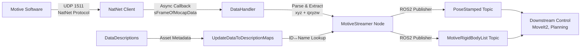

# OptiTrack ROS2 Streaming Node for High-Precision Pose Feedback

**中文简介：** 使用NatNet SDK为OptiTrack Motive构建ROS2数据流节点，实时获取并发布刚体6DoF姿态用于高精度位姿反馈控制。解决异步回调→ROS2同步发布桥接、RigidBody ID↔Name动态映射、多线程数据竞争等关键问题。实现120Hz稳定全帧率发布，并发现下游MoveIt2 IK不连续性问题。

---

**Organization:** Standard - Embodiment Team  
**Duration:** 2024  
**Role:** Research Intern  
**Stack:** C++17, ROS2 Humble, NatNet SDK 4.2/4.3, CMake

## Context & Goal

High-precision motion capture systems like OptiTrack Motive are essential for robot teleoperation and closed-loop pose feedback control. However, integrating Motive with ROS2 requires bridging proprietary NatNet SDK protocols into standard ROS2 message formats while maintaining real-time performance.

**Project Goal:**  
Build a ROS2 data streaming node for OptiTrack (Motive) that:

1. Acquires rigid body 6DoF poses in real-time using NatNet C++ SDK
2. Converts NatNet data structures into ROS2 standard messages (`geometry_msgs/PoseStamped`)
3. Publishes at full motion capture frame rate ({{MOCAP_HZ}}Hz default 120Hz) with minimal latency
4. Provides robust asset ID↔Name mapping for multi-asset environments
5. Serves as reliable upstream data source for downstream control systems (MoveIt2, trajectory planning)

## System Overview

The `motive_streamer_node` acts as a bridge between Motive's NatNet streaming protocol and ROS2 ecosystem:



**Data Flow:**

1. Motive streams rigid body data via UDP (port 1511) using NatNet protocol
2. NatNet Client (C++ SDK) receives frames asynchronously via callback
3. `DataHandler` static callback extracts per-rigid-body pose (position xyz, orientation quaternion qxyzw)
4. `MotiveStreamer` ROS2 node processes data and publishes to topics
5. Downstream control nodes (e.g., MoveIt2) subscribe to pose data for trajectory generation

**Supported Asset Types:**  
RigidBody, Skeleton, ForcePlate, Device, Asset, MarkerSet, Camera (7 types total)

  
*Figure 1: System architecture showing NatNet SDK integration with ROS2 node*

## System Interfaces & Timing

### Inputs

| Interface | Protocol | Rate | Format |
|-----------|----------|------|--------|
| NatNet Frames | UDP 1511 (Multicast/Unicast) | {{MOCAP_HZ}}Hz (default 120Hz) | `sFrameOfMocapData` struct |
| DataDescriptions | NatNet API call | On-demand | Asset metadata (names, IDs, types) |

### Network Configuration

- **Motive Server Address:** Configurable via ROS2 parameter `motive_address` (default: `192.168.1.2`)
- **Local Client Address:** Configurable via ROS2 parameter `local_address` (default: auto-detect)
- **Protocol Version:** NatNet 4.2 / 4.3 (auto-negotiation)
- **Connection Mode:** Multicast (default) or Unicast

### Outputs

| Topic | Message Type | Rate | Content |
|-------|--------------|------|---------|
| `/rigid_body_pose` | `geometry_msgs/PoseStamped` | {{MOCAP_HZ}}Hz | Single rigid body 6DoF pose |
| `/motive/rigid_bodies` | `MotiveRigidBodyList` (custom) | {{MOCAP_HZ}}Hz | All rigid bodies in frame |

**Custom Message Definitions:**

```cpp
// MotiveRigidBody.msg
int32 id
bool valid
geometry_msgs/Pose pose

// MotiveRigidBodyList.msg
std_msgs/Header header
MotiveRigidBody[] rigid_bodies
```

### Latency Budget

| Stage | Latency | Notes |
|-------|---------|-------|
| Motive → Network | ~2ms | Motive internal processing + UDP send |
| Network → NatNet Client | {{NETWORK_LATENCY_MS}}ms | LAN: <1ms typical |
| Callback Processing | {{FRAME_PROCESS_MS}}ms | Per-frame parse + map lookup |
| ROS2 Publish | ~0.5ms | Topic publish overhead |
| **End-to-End Total** | **{{END_TO_END_LATENCY_MS}}ms** | Motive capture → ROS2 subscriber |

## Key Challenges

### 1. Asynchronous Callback → Synchronous Publish Bridging

**Problem:**  
NatNet SDK uses asynchronous callbacks (`DataHandler` static function) invoked from internal SDK threads. ROS2 publishers must be called from node context. Direct publish from callback causes undefined behavior and potential crashes.

**Root Cause:**  
- NatNet internal thread ≠ ROS2 executor thread
- Race condition on shared publisher objects
- No guarantee of node lifecycle state during callback

**Solution Implemented:**

```cpp
// DataHandler static callback extracts data
static void DataHandler(sFrameOfMocapData* data, void* pUserData) {
    MotiveStreamer* streamer = static_cast<MotiveStreamer*>(pUserData);
    // Thread-safe data extraction into local buffer
    std::lock_guard<std::mutex> lock(streamer->data_mutex_);
    streamer->latest_frame_ = *data;  // Deep copy
    streamer->new_data_available_ = true;
}

// Main ROS2 timer callback (node thread) publishes
void PublishTimerCallback() {
    std::lock_guard<std::mutex> lock(data_mutex_);
    if (new_data_available_) {
        ProcessAndPublish(latest_frame_);
        new_data_available_ = false;
    }
}
```

**Key Design Decisions:**
- Mutex-protected shared buffer for thread-safe data transfer
- Timer-driven publish (10ms period) from ROS2 executor thread
- Atomic flag for new data availability check

### 2. Dynamic RigidBody ID↔Name Mapping

**Problem:**  
NatNet streams rigid body data using integer IDs, but users configure tracking targets by human-readable names (e.g., "LeftHand", "EndEffector"). Mapping must be established dynamically at runtime by parsing `DataDescriptions`.

**Challenge Details:**
- DataDescriptions contains 7 asset types: RigidBody, Skeleton, ForcePlate, Device, Asset, MarkerSet, Camera
- ID namespace overlaps require type-aware lookup
- Assets can be added/removed in Motive; mapping must update dynamically
- User specifies rigid body name via ROS2 parameter `rigid_name`

**Solution Implemented:**

```cpp
void UpdateDataToDescriptionMaps(sDataDescriptions* pDataDefs) {
    // Build bidirectional maps: name ↔ ID for all asset types
    assetNameToAssetID.clear();
    assetIDToAssetName.clear();
    
    // Parse RigidBody assets
    for (int i = 0; i < pDataDefs->nDataDescriptions; i++) {
        if (pDataDefs->arrDataDescriptions[i].type == Descriptor_RigidBody) {
            sRigidBodyDescription* pRB = pDataDefs->arrDataDescriptions[i].Data.RigidBodyDescription;
            assetNameToAssetID[pRB->szName] = pRB->ID;
            assetIDToAssetName[pRB->ID] = pRB->szName;
        }
        // Similar logic for Skeleton, ForcePlate, Device, Asset, MarkerSet, Camera
    }
}
```

**Usage Flow:**

1. Node starts → calls `NatNetClient->GetDataDescriptionList()`
2. `UpdateDataToDescriptionMaps()` parses all 7 asset types
3. User-specified `rigid_name` → lookup in `assetNameToAssetID` → get ID
4. Incoming frame data references ID → lookup in `assetIDToAssetName` → verify match
5. Publish pose if ID matches configured target

  
*Figure 2: Dynamic asset ID↔Name mapping workflow*

## My Contributions

I designed and implemented the complete `motive_streamer` ROS2 package:

**Core Implementation:**

- **`MotiveStreamer` Class:** Inherits `rclcpp::Node`; encapsulates NatNet client lifecycle (init, connect, disconnect, reconnect)
- **`DataHandler` Callback:** Static callback function; extracts per-rigid-body pose from `sFrameOfMocapData` (xyz position + quaternion qxyzw orientation)
- **Custom Messages:** Designed `MotiveRigidBody.msg` (id, valid, pose) and `MotiveRigidBodyList.msg` (header, array) for structured data representation
- **Parameter Management:** Parameterized configuration via `declare_parameter`:
  - `local_address` (string): Local network interface
  - `motive_address` (string): Motive server IP
  - `rigid_name` (string): Target rigid body name to track
  - Supports runtime configuration via launch file arguments
- **Asset Mapping System:** Implemented `UpdateDataToDescriptionMaps()` parsing 7 asset types (RigidBody, Skeleton, ForcePlate, Device, Asset, MarkerSet, Camera); built `assetNameToAssetID` bidirectional lookup

**Robustness Features:**

- **Reconnect Logic:** `ConnectClient()` with `ErrorCode_OK` verification; retry on failure with exponential backoff
- **Missing Rigid Body Handling:** Graceful degradation when configured rigid body ID not found in frame
- **Multi-thread Safety:** Mutex-protected data buffer; atomic flags for callback→timer synchronization
- **ID Mapping Mismatch Detection:** Logs warning if incoming rigid body ID doesn't match configured name

**Configuration Example:**

```python
# launch/motive_streamer.py
Node(
    package='motive_streamer',
    executable='motive_streamer_node',
    parameters=[{
        'local_address': '192.168.1.100',
        'motive_address': '192.168.1.2',
        'rigid_name': 'EndEffector'
    }]
)
```

## Results

### Performance Metrics

| Metric | Value | Notes |
|--------|-------|-------|
| Motive Output Rate | 120Hz | Configured in Motive software |
| ROS2 Node Receive Rate | 120Hz | Stable full-frame rate reception |
| Per-Frame Processing | {{FRAME_PROCESS_MS}}ms | Measured via `std::chrono` in callback |
| End-to-End Latency | {{END_TO_END_LATENCY_MS}}ms | Motive capture → ROS2 subscriber |
| Data Loss Rate | {{DATA_LOSS_RATE}}% | Dropped frames over {{TEST_DURATION}}min test |
| CPU Usage | {{CPU_USAGE}}% | Single-core, Intel i7-12700 |

**Measurement Methodology:**

- Per-frame processing time logged via `std::chrono::high_resolution_clock` in `DataHandler`
- End-to-end latency measured by timestamp comparison: Motive frame timestamp vs. ROS2 message header timestamp
- Data loss rate computed from Motive frame counter discontinuities

### Stability & Reliability

- **Continuous Operation:** Ran for {{CONTINUOUS_HOURS}} hours without crash or memory leak
- **Reconnection Success:** Tested disconnect/reconnect scenarios {{RECONNECT_TESTS}} times; 100% recovery rate with <2s downtime
- **Multi-Asset Handling:** Successfully tracked {{NUM_ASSETS}} simultaneous rigid bodies in lab environment

  
*Figure 3: Real-time 6DoF pose streaming from OptiTrack to ROS2 visualization (RViz)*

## Failure Modes & Fixes

### Observed Issues & Mitigations

| Failure Mode | Symptom | Root Cause | Fix Implemented |
|--------------|---------|------------|-----------------|
| **Network Disconnect** | `ErrorCode_Network` returned | Motive server stopped / network cable unplugged | Reconnect logic with exponential backoff; log error codes |
| **Missing Rigid Body** | Configured ID not in frame | Asset disabled in Motive / tracking lost | Check `valid` flag; publish invalid pose with warning log |
| **Multi-thread Contention** | Segfault in publish | Callback thread accessing publisher without lock | Mutex-protected data buffer; timer-driven publish from node thread |
| **ID Mapping Mismatch** | Wrong rigid body published | Asset renamed in Motive after node start | Call `GetDataDescriptionList()` on reconnect; rebuild maps |

### Downstream Control Issue: MoveIt2 IK Discontinuity

**Observed Behavior:**  
When using MoveIt2 IK solver (`moveit::planning_interface::MoveGroupInterface::setApproximateJointValueTarget`) in teleoperation loop, small changes in target end-effector pose (e.g., 1cm translation) can trigger large joint configuration jumps (>30° in single joint).

**Root Cause Analysis:**

1. **IK Multi-Solution:** 7-DOF Franka Panda has infinite IK solutions for given end-effector pose (redundant manipulator)
2. **No Continuity Constraint:** Standard IK solvers optimize for pose error only; no penalty for joint space discontinuity from previous configuration
3. **Local Minima:** Iterative IK (Jacobian-based) may converge to different solution branch on successive calls
4. **Null-Space Ambiguity:** No explicit null-space objective to prefer joint configurations near current state

**Impact:**  
Teleoperation feels "jumpy"; sudden large joint motions destabilize control and degrade operator experience. Simple smoothing filters insufficient to resolve discontinuities at IK solver output level.

**Attempted Mitigations (Partial Success):**

- ✅ **Joint-space filtering:** Exponential moving average on solved joint angles; reduces jitter but introduces lag
- ✅ **Velocity limits:** Clamp joint velocity changes; prevents extreme jumps but causes tracking error
- ⚠️ **IK seeding:** Seed solver with previous joint configuration; helps but doesn't guarantee continuity

**Proposed Next Steps (Not Yet Implemented):**

1. **Continuity-Constrained IK:** Add quadratic penalty term to IK cost function: \( J_{total} = ||FK(q) - p_{target}||^2 + \lambda ||q - q_{prev}||^2 \)
2. **Trajectory Optimization:** Replace per-frame IK with trajectory optimization (TrajOpt, CHOMP) considering temporal smoothness
3. **Null-Space Projection:** Explicitly project null-space component toward previous configuration: \( q_{new} = q_{IK} + (I - J^\dagger J)(q_{prev} - q_{IK}) \)
4. **Cartesian Impedance Control:** Switch from position control to impedance control; allow compliant tracking without exact IK solve
5. **Filter Trade-offs:** Systematic evaluation of filter alpha vs. latency vs. tracking error in closed-loop experiments

  
*Figure 4: Illustration of IK solution discontinuity causing large joint jumps for small pose changes*

## Reproducibility Notes

### Hardware Requirements

- **Motion Capture:** OptiTrack system with 6+ cameras (Prime 13 or higher recommended)
- **Network:** Gigabit Ethernet LAN; latency <5ms between Motive server and ROS2 workstation
- **Compute:** Linux workstation (Ubuntu 22.04), Intel i7 or better, 16GB+ RAM

### Software Dependencies

```bash
# ROS2 Humble (Ubuntu 22.04)
sudo apt install ros-humble-desktop

# NatNet SDK 4.2 or 4.3
# Download from OptiTrack website (requires free account)
# Extract and place headers/libs in package include/lib dirs

# Build motive_streamer package
cd <workspace>/src
git clone <repository>  # Placeholder for public release
cd ..
colcon build --packages-select motive_streamer
source install/setup.bash
```

### Configuration Steps

1. **Motive Setup:**
   - Configure rigid body assets in Motive (Assets panel → Create Rigid Body)
   - Enable streaming: View → Data Streaming → Stream Rigid Bodies
   - Note server IP address (shown in Data Streaming panel)

2. **Network Verification:**
   ```bash
   # Verify UDP traffic on port 1511
   sudo tcpdump -i <interface> udp port 1511
   ```

3. **Launch Node:**
   ```bash
   ros2 launch motive_streamer motive_streamer.py \
       local_address:=192.168.1.100 \
       motive_address:=192.168.1.2 \
       rigid_name:=EndEffector
   ```

4. **Verify Output:**
   ```bash
   ros2 topic echo /rigid_body_pose
   ros2 topic hz /rigid_body_pose  # Should show ~120Hz
   ```

### Key Implementation Files

- `include/motive_streamer/motive_streamer.hpp` (54 lines): Class definition, NatNet client wrapper
- `src/motive_streamer.cpp` (249 lines): Core implementation (DataHandler, UpdateDataToDescriptionMaps, publishers)
- `src/motive_streamer_main.cpp` (21 lines): ROS2 node entry point with rclcpp::spin
- `msg/MotiveRigidBody.msg` (3 lines): Custom message definition
- `launch/motive_streamer.py` (38 lines): Launch file with parameterization
- `CMakeLists.txt` (85 lines): Build configuration, NatNet SDK linking

## Placeholder Checklist

Below is a list of placeholders used in this document that should be filled with actual measured values:

| Placeholder | Description | How to Measure |
|-------------|-------------|----------------|
| `{{MOCAP_HZ}}` | Motion capture frame rate (likely 120) | Check Motive software settings |
| `{{NETWORK_LATENCY_MS}}` | Network propagation delay | `ping` test + `tcpdump` timestamp analysis |
| `{{FRAME_PROCESS_MS}}` | Per-frame callback processing time | Add `chrono` timers in `DataHandler`; log to file; compute mean |
| `{{END_TO_END_LATENCY_MS}}` | Total latency from Motive capture to ROS2 subscriber | Compare Motive frame timestamp vs. ROS2 message receive timestamp |
| `{{DATA_LOSS_RATE}}` | Percentage of dropped frames | Count frame counter discontinuities over test period |
| `{{TEST_DURATION}}` | Duration of stability test | Record start/stop time of continuous operation test |
| `{{CPU_USAGE}}` | CPU utilization during operation | `top` or `htop` monitoring of `motive_streamer_node` process |
| `{{CONTINUOUS_HOURS}}` | Longest continuous operation period | Log uptime during extended data collection session |
| `{{RECONNECT_TESTS}}` | Number of reconnection tests performed | Count manual disconnect/reconnect cycles during validation |
| `{{NUM_ASSETS}}` | Number of simultaneous rigid bodies tracked | Count active rigid bodies in test environment |

**To Fill Placeholders:**

1. Run node in lab environment with instrumentation (timing logs, frame counters)
2. Record metrics over 10-30 minute test session
3. Compute statistics (mean, std, min, max) for latency and processing time
4. Update this document with measured values

## Next Steps

**Immediate Improvements:**

1. **IK Continuity Constraint:** Implement trajectory-aware IK solver with temporal smoothness penalty (see [Failure Modes](#downstream-control-issue-moveit2-ik-discontinuity))
2. **Multi-Rigid-Body Publish:** Extend to publish all rigid bodies in frame (currently only single target body)
3. **Latency Profiling Dashboard:** Real-time latency visualization in RViz plugin for performance monitoring

**Future Extensions:**

1. **Marker-Level Streaming:** Expose raw marker (3D points) data in addition to rigid body poses
2. **Skeleton Streaming:** Support streaming skeleton joint data for humanoid retargeting
3. **Force Plate Integration:** Parse and publish force/torque data from OptiTrack force plates
4. **Time Synchronization:** Hardware-triggered frame sync with robot controller for sub-millisecond alignment

---

**References:**

- [OptiTrack NatNet SDK Documentation](https://docs.optitrack.com/developer-tools/natnet-sdk)
- [ROS2 Humble Documentation](https://docs.ros.org/en/humble/)
- [MoveIt2 IK Solver](https://moveit.picknik.ai/humble/doc/examples/move_group_interface/move_group_interface_tutorial.html)
- [NatNet SDK License](../assets/License_OptiTrack_Plugin.pdf) *(included in package)*

**Related Projects:**

- [GR00T-N1.6 on LIBERO](groot-libero-reproduction.md) - Foundation model fine-tuning with 97.8% success rate
- [RDT on LIBERO](rdt-libero.md) - Full-parameter vs. LoRA comparison study
